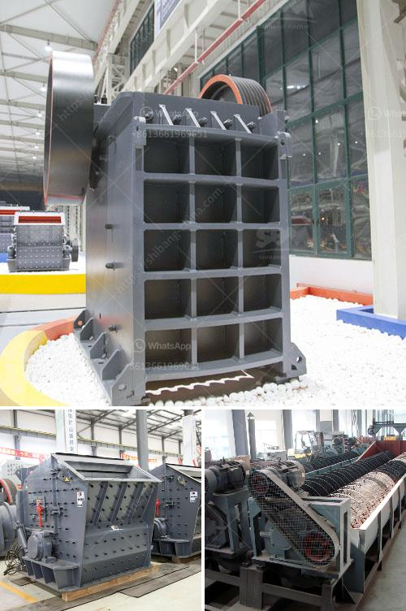

<h3>powder mill machinery process pdf</h3>
Powder mill machinery plays a crucial role in various industries, including pharmaceuticals, chemicals, and minerals. These machines are designed to convert raw materials into fine powders or granules, which are then used for further processing or manufacturing applications. To ensure optimal performance and productivity, it is essential for industry professionals to have a deep understanding of the powder mill machinery process. A comprehensive and detailed resource that provides this information is the powder mill machinery process PDF.

The powder mill machinery process PDF offers a wealth of information about the different stages involved in the production of fine powders or granules. It provides step-by-step instructions, guidelines, and illustrations that help operators set up and operate these machines efficiently. This comprehensive document includes details about the equipment used, safety precautions, troubleshooting techniques, and maintenance recommendations.

One of the primary aspects covered in the powder mill machinery process PDF is the equipment involved in the process. It explains the function and operation of each machine, such as crushers, grinders, pulverizers, classifiers, and mixers. This knowledge is essential for operators as they need to understand how each equipment component contributes to the overall milling process. Additionally, the PDF provides insights into the selection criteria for these machines, allowing professionals to make informed decisions when choosing the right equipment for their specific manufacturing needs.

Safety is of utmost importance in any industrial setting, and the powder mill machinery process PDF addresses this crucial aspect. It outlines the safety guidelines that operators must follow to prevent accidents and ensure the well-being of the workforce. This includes wearing appropriate personal protective equipment, implementing lockout/tagout procedures, and conducting regular equipment inspections. By understanding and adhering to these safety measures, industry professionals can significantly reduce the risk of potential hazards.

Troubleshooting is an inevitable part of any manufacturing process. The powder mill machinery process PDF includes a dedicated section on identifying and resolving common issues that operators may encounter during operation. It provides a comprehensive list of possible problems and offers detailed troubleshooting techniques to rectify them. This resource empowers operators to quickly diagnose and resolve issues, minimizing downtime and optimizing production output.

To ensure the longevity and optimal performance of powder mill machinery, regular maintenance is essential. The PDF document offers insights into maintenance best practices, including routine inspections, lubrication procedures, and recommended cleaning techniques. By following these maintenance recommendations, industry professionals can extend the lifespan of their equipment and prevent costly breakdowns.

In conclusion, the powder mill machinery process PDF is an indispensable resource for industry professionals involved in the production and manufacturing of fine powders or granules. It provides a comprehensive understanding of the entire milling process, from equipment selection to troubleshooting and maintenance. By leveraging the knowledge and guidelines presented in this document, operators can enhance their operational efficiency, ensure workplace safety, and maximize the lifespan of their machinery.
<h3>Contact us</h3><ul><li><strong>Whatsapp:&nbsp;<a href="https://wa.me/8613661969651">+8613661969651</a></strong></li><li><a href="https://swt.shibang-china.com/?git&amp;zhl&amp;powder mill machinery process pdf"><strong>Online Service(chat now)</strong></a></li></ul><h3>Related</h3><ul><li><a href='quartz bulk supplier sri lanka.md'>quartz bulk supplier sri lanka</a></li><li><a href='belt conveyor design free.md'>belt conveyor design free</a></li><li><a href='mobile used crushing and screening plant for sale.md'>mobile used crushing and screening plant for sale</a></li><li><a href='how to start a coal mine.md'>how to start a coal mine</a></li><li><a href='sand making machine application.md'>sand making machine application</a></li></ul>