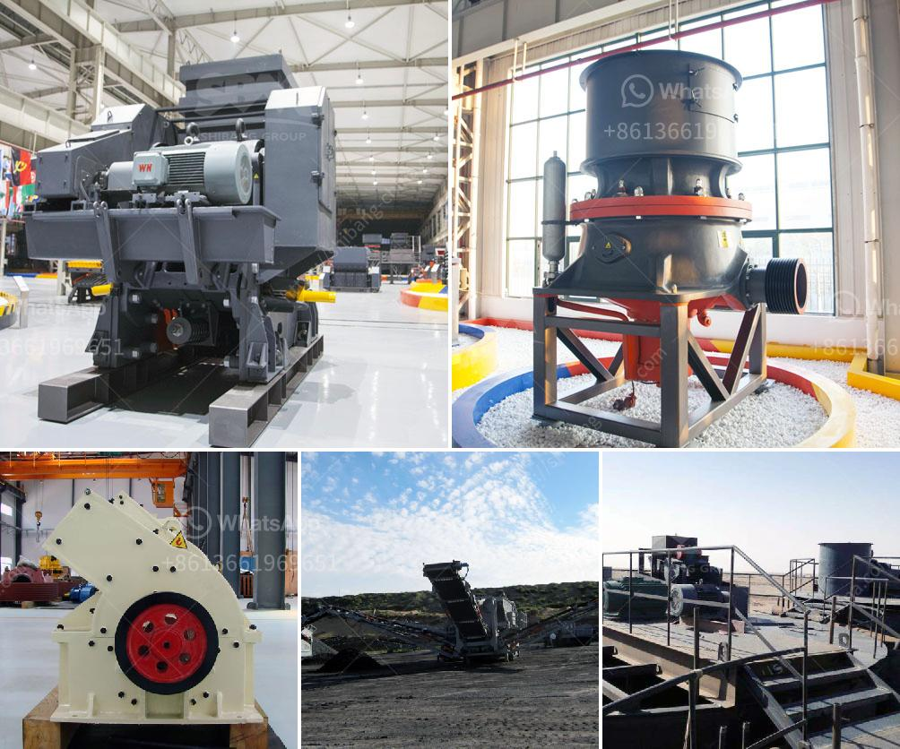

<h3>powder production line price</h3>
The price of a powder production line can vary greatly depending on several factors such as the capacity, technology, and materials used. Powder production lines are used in various industries including food processing, pharmaceutical manufacturing, and chemical production. These lines are designed to efficiently produce powdered substances, ensuring higher productivity and better quality of the final product. Understanding the factors that influence the price of a powder production line is crucial for businesses looking to invest in this equipment.

One of the main factors that determine the price of a powder production line is its capacity. The production capacity of these lines can range from a few kilograms per hour to several tons per hour. Generally, higher capacities demand more extensive machinery and sophisticated technology, leading to higher overall costs. Therefore, businesses need to carefully assess their daily production requirements and choose a line that offers the most suitable capacity for their needs.

The technology employed in a powder production line also affects its price. Advanced technologies such as automated systems, computerized controls, and precise measuring instruments can significantly increase the cost of the production line. These technologies, however, offer several benefits including improved accuracy, reduced downtime, and higher efficiency. It is important for businesses to balance their budget with their production needs to ensure that they invest in the right level of technology for their operations.

Another factor that influences the price of a powder production line is the materials used in its construction. The quality of the materials can vary, with some machinery made of standard steel while others are manufactured with stainless steel, which offers corrosion resistance and durability. Machinery made with higher-quality materials tends to come at a higher price. However, the additional cost can be justified by the longer lifespan and reduced maintenance requirements of the equipment.

When comparing prices of different powder production lines, it is also essential to consider after-sales services. Some suppliers may provide installation and training services, while others may charge extra for these. It is important to factor in these costs to understand the overall price and value proposition of the production line.

To get an accurate understanding of the price of a powder production line, businesses should reach out to multiple suppliers and request detailed quotations. They should inquire about the specifications, production capacity, technology, and materials used in the equipment, as well as any additional services included in the price. By comparing these quotations and evaluating them against their specific production requirements, businesses can make an informed decision and choose the most cost-effective powder production line.

Investing in a powder production line can significantly enhance the efficiency, quality, and profitability of a business. However, it is crucial to consider the factors that impact the price of these lines in order to make a wise investment decision. By analyzing the capacity, technology, materials, and after-sales services, businesses can find a powder production line that meets their needs at a competitive price. Careful evaluation and comparison of different options will ensure that the investment in a powder production line yields the desired results in terms of increased productivity and profitability.
<h3>Contact us</h3><ul><li><strong>Whatsapp:&nbsp;<a href="https://wa.me/8613661969651">+8613661969651</a></strong></li><li><a href="https://swt.shibang-china.com/?git&amp;zhl&amp;powder production line price"><strong>Online Service(chat now)</strong></a></li></ul><h3>Related</h3><ul><li><a href='harga mesin ball mill.md'>harga mesin ball mill</a></li><li><a href='crusher on lease basis in nigeria.md'>crusher on lease basis in nigeria</a></li><li><a href='used industrial stone crushers for sale.md'>used industrial stone crushers for sale</a></li><li><a href='rubber conveyor belt manufacturers in turkey.md'>rubber conveyor belt manufacturers in turkey</a></li><li><a href='crushers manufacturers in south africa.md'>crushers manufacturers in south africa</a></li></ul>