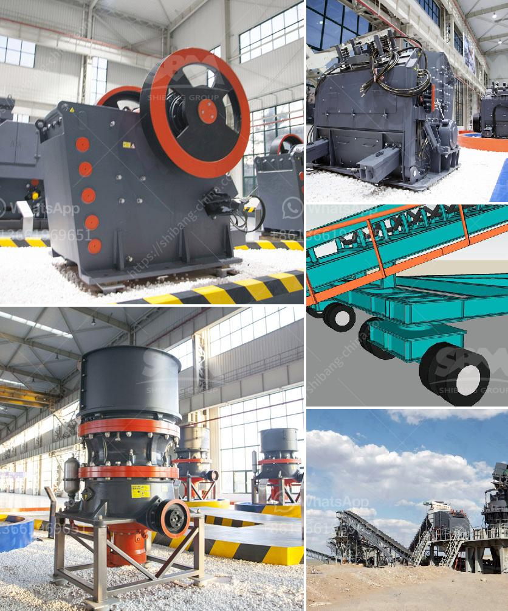

<h3>precipitated calcium carbonate process</h3>
Precipitated calcium carbonate (PCC) is a versatile chemical compound that plays a crucial role in several industries. It is produced through a complex process that involves high-quality limestone and careful control of various chemical reactions. In this article, we will explore the process of producing precipitated calcium carbonate and its numerous applications.

The production of precipitated calcium carbonate typically begins with the extraction of high-quality limestone deposits from quarries. These limestone deposits are known for their high calcium carbonate content and are carefully selected for the manufacturing process. The limestone is then crushed into small pieces and transported to the production facility.

At the production facility, the crushed limestone is further processed to remove impurities and make it suitable for the desired applications. Impurities like clay, silt, and other minerals are removed through a process called washing. After washing, the limestone is finely ground into a powder form.

The ground limestone powder is then fed into a reactor, where it undergoes chemical reactions to convert it into precipitated calcium carbonate. The reactor is a controlled environment that allows for the regulation of reaction conditions such as temperature, pH, and concentration. Several chemical reactions take place in the reactor, involving the addition of chemicals like lime, carbon dioxide, and water.

The main chemical reaction that occurs in the reactor is the combination of calcium hydroxide (lime) with carbon dioxide to form calcium carbonate. The reaction is as follows:

This reaction results in the formation of fine particles of precipitated calcium carbonate suspended in water. The suspension is then filtered to remove any remaining impurities and collect the desired product.

The filtered precipitated calcium carbonate is then dried and further processed to achieve the desired particle size and surface properties. Various techniques such as milling, grinding, and classification are employed to modify the physical characteristics of the PCC particles.

The precipitated calcium carbonate obtained from this process is a high-purity product with consistent particle size and morphology. Its fine particle size and high surface area make it suitable for a wide range of applications. PCC is commonly used as a filler material in industries like paper, plastics, rubber, and paints. It provides opacity, brightness, and smoothness to paper and enhances the mechanical properties of various plastic and rubber products.

Furthermore, PCC is also used as a dietary supplement, especially for individuals with calcium deficiencies. It is often incorporated into pharmaceutical formulations, dietary supplements, and in the fortification of a variety of food and beverage products.

In conclusion, the precipitated calcium carbonate process involves the extraction of high-quality limestone, its purification, chemical reactions, filtration, and further processing to achieve the desired properties. This versatile compound finds diverse applications in various industries, from papermaking to pharmaceuticals. The production of precipitated calcium carbonate supports multiple economic sectors and contributes to the development of innovative products that improve our daily lives.
<h3>Contact us</h3><ul><li><strong>Whatsapp:&nbsp;<a href="https://wa.me/8613661969651">+8613661969651</a></strong></li><li><a href="https://swt.shibang-china.com/?git&amp;zhl&amp;precipitated calcium carbonate process"><strong>Online Service(chat now)</strong></a></li></ul><h3>Related</h3><ul><li><a href='gold hammer mills for sale south africa.md'>gold hammer mills for sale south africa</a></li><li><a href='used portable crushing plant philippines.md'>used portable crushing plant philippines</a></li><li><a href='potassium ore production equipment.md'>potassium ore production equipment</a></li><li><a href='how to improve grinding efficiency of a mill.md'>how to improve grinding efficiency of a mill</a></li><li><a href='germany rocks crushers.md'>germany rocks crushers</a></li></ul>