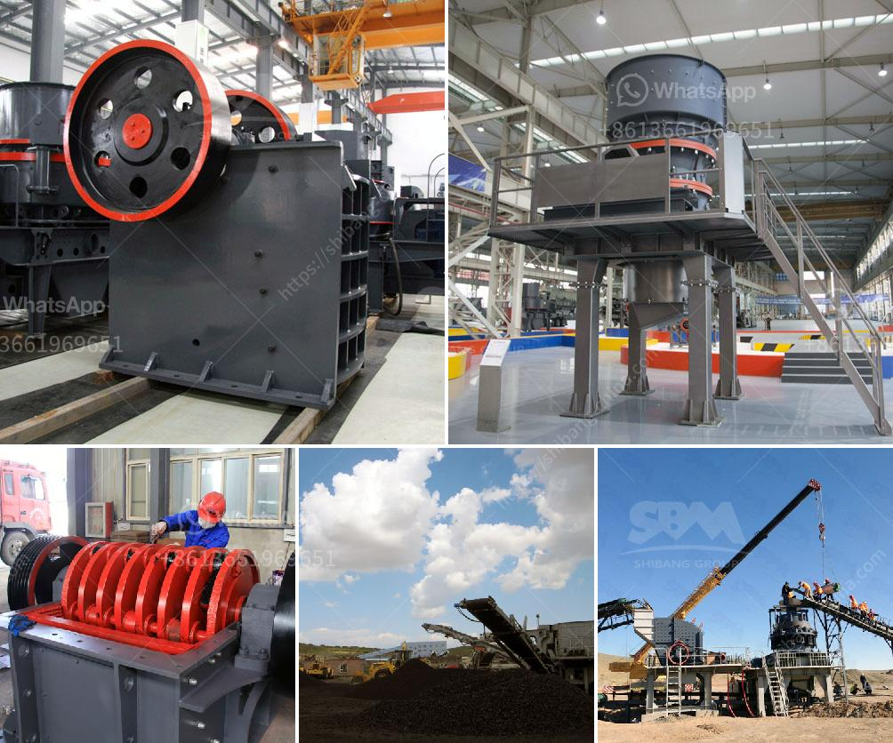

<h3>price ball mill 40tph</h3>
The price of a ball mill is an essential factor that helps in purchasing the appropriate ball mill for a particular application. The price of a ball mill varies depending on various factors, including its capacity, material of construction, and features. In this article, we will discuss the price of a 40TPH ball mill in detail.

A ball mill is a type of grinder used to grind materials into extremely fine powder for use in mineral dressing processes, paints, pyrotechnics, ceramics, and selective laser sintering. The 40TPH ball mill is widely used in the mining industry, construction industry, and other industries due to its excellent performance.

When purchasing a ball mill, one must consider several factors that directly impact the price. The capacity of the ball mill plays a crucial role in determining its price. Typically, a ball mill with a higher capacity will have a higher price compared to a ball mill with a lower capacity. A 40TPH ball mill has a moderate capacity, making it suitable for various industrial applications.

The material of construction is another critical factor affecting the price of a ball mill. Depending on the application requirements, ball mills can be constructed using different materials, such as stainless steel, ceramic, or rubber. Each material has its advantages and disadvantages. Stainless steel ball mills are durable and resistant to corrosion but are relatively expensive. On the other hand, ceramic ball mills are wear-resistant and cost-effective. The choice of material depends on the specific application and budgetary constraints.

Additional features and functionalities of the ball mill may also impact its price. Some ball mills come with advanced features like variable speed control, digital timers, and temperature monitoring systems. These features enhance the efficiency and versatility of the ball mill, but they come at an additional cost. It is essential to consider the specific requirements of the application and decide whether these additional features are necessary.

Apart from the features and the material of construction, the brand and reputation of the manufacturer also play a crucial role in determining the price. Well-established brands with a strong reputation often charge a premium for their products. However, this premium reflects the quality and reliability of the ball mill.

The price of a 40TPH ball mill can range from a few thousand dollars to several hundred thousand dollars, depending on the factors mentioned above. It is essential to carefully consider the specific requirements of the application, budget constraints, and long-term operational costs before making a purchase.

To find the best price for a 40TPH ball mill, it is recommended to compare prices from multiple manufacturers and suppliers. This will help in identifying the most competitive pricing while ensuring the quality and reliability of the product.

In conclusion, the price of a 40TPH ball mill depends on various factors, including its capacity, material of construction, additional features, and the reputation of the manufacturer. It is crucial to carefully evaluate these factors and compare prices from different sources to make an informed decision.
<h3>Contact us</h3><ul><li><strong>Whatsapp:&nbsp;<a href="https://wa.me/8613661969651">+8613661969651</a></strong></li><li><a href="https://swt.shibang-china.com/?git&amp;zhl&amp;price ball mill 40tph"><strong>Online Service(chat now)</strong></a></li></ul><h3>Related</h3><ul><li><a href='washing process of chromite ore beneficiation.md'>washing process of chromite ore beneficiation</a></li><li><a href='powder ball milling machines.md'>powder ball milling machines</a></li><li><a href='process of cement.md'>process of cement</a></li><li><a href='quarry crusher with 60 tph.md'>quarry crusher with 60 tph</a></li><li><a href='stone crusher machine sale tanzania.md'>stone crusher machine sale tanzania</a></li></ul>