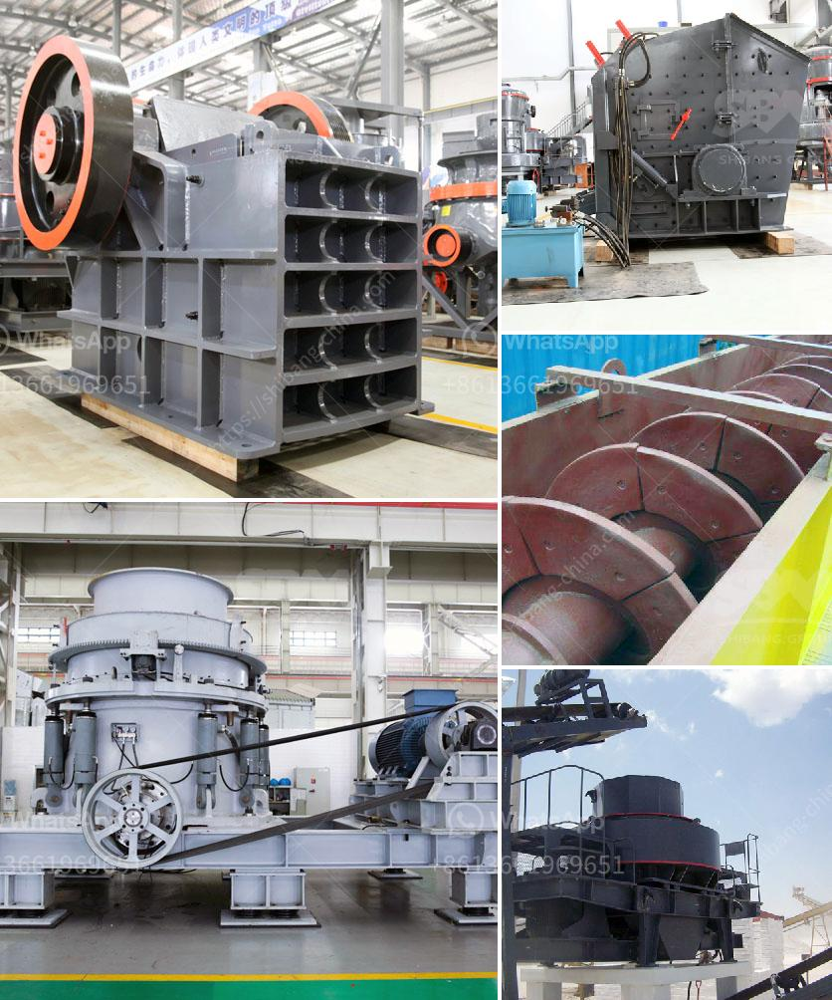

<h3>price crusher machinery price</h3>
In today's dynamic market, businesses face a constant challenge of achieving higher productivity while keeping costs under control. One of the crucial aspects that can significantly impact a company's bottom line is the price of machinery. Whether you are a small-scale enterprise or a large multinational corporation, finding the right price for crusher machinery is essential for unlocking value and maximizing profitability.

The price of crusher machinery varies depending on various factors such as brand reputation, quality, technical specifications, and additional features. Therefore, it is crucial to conduct thorough research and analysis before making a purchasing decision. Here, we explore the importance of considering price and how it can create value for your business.

Firstly, it is important to note that a lower price does not always mean the best value. While the initial investment might be lower for cheaper machinery, it is imperative to assess the long-term benefits and overall cost-effectiveness of the equipment. Machinery that is priced competitively but lacks durability or requires frequent maintenance and repairs can lead to increased operational costs and disruptions to your production line.

Conversely, investing in machinery with a higher price tag might seem intimidating initially. However, it can often lead to significant cost savings in the long run. Premium equipment usually comes with better-built quality, enhanced performance, and advanced features that can streamline your processes, reduce downtime and improve efficiency. Higher-quality machinery typically requires less maintenance, minimizing expenses associated with repairs and replacements.

Furthermore, the price of crusher machinery should also be evaluated in the context of its productivity and output. Machinery with a higher price might have superior crushing capabilities, enabling your business to process larger quantities of materials in a shorter period. This increased productivity can directly translate into higher revenues and improved customer satisfaction.

It is also essential to consider the reputation of the brand and the after-sales support offered. Renowned manufacturers often have a well-established distribution and service network, providing faster response times and ensuring that any issues are resolved promptly. While cheaper alternatives might be available in the market, they may lack the necessary resources or expertise to respond effectively, leading to extended downtime and negative impacts on your business.

To ensure that you are getting the best value for your investment, it is recommended to obtain multiple quotes from different suppliers. Comparing prices while taking into account the aforementioned factors will provide you with a comprehensive understanding of the market and aid in making an informed decision.

In conclusion, prices of crusher machinery play a vital role in determining the value it brings to your business. While a lower price may seem attractive initially, it is crucial to consider factors such as durability, performance, productivity, and brand reputation to assess the long-term cost-effectiveness. By investing in machinery that strikes the right balance between price and value, businesses can unlock their true potential, improve operational efficiency, and ensure sustainable growth in today's fiercely competitive market.
<h3>Contact us</h3><ul><li><strong>Whatsapp:&nbsp;<a href="https://wa.me/8613661969651">+8613661969651</a></strong></li><li><a href="https://swt.shibang-china.com/?git&amp;zhl&amp;price crusher machinery price"><strong>Online Service(chat now)</strong></a></li></ul><h3>Related</h3><ul><li><a href='sewa mobile stone crusher di indonesia.md'>sewa mobile stone crusher di indonesia</a></li><li><a href='address of stone crasher plant in westbengal.md'>address of stone crasher plant in westbengal</a></li><li><a href='complete crushing plant solutions prices.md'>complete crushing plant solutions prices</a></li><li><a href='coal crushing plant for sale in south africa.md'>coal crushing plant for sale in south africa</a></li><li><a href='ballast crushing plant.md'>ballast crushing plant</a></li></ul>