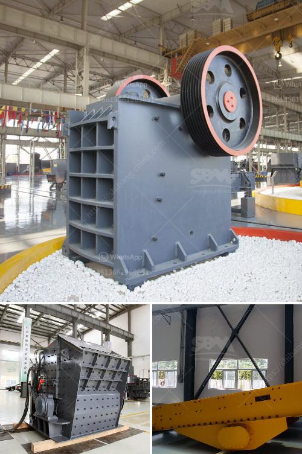

<h3>price for mobile stone crushers in japan</h3>
The mobile stone crusher is a machine that often wears high-strength grinding, but if it does not do well before the use of the mobile stone crusher, it will affect the production and, in serious cases, the mobile crusher Damaged, causing serious safety accidents. Therefore, in the use of the necessary preparatory tasks, we can at a certain level of understanding of the Mobile Crusher in Japan, we can understand to determine the price, quality and other issues about Mobile Crusher.

The characteristics of the Japanese mobile stone crusher are that it adopts a new hydraulic mechanism design, which facilitates the movement of the movable cone, the eccentric shaft, the heavy-duty crawler chassis and the multifunctional crusher, which adopts hydraulic lubrication system, with more intelligent automatic control system. In the domestic market, the price of the Mobile Crusher is not uniform, and there are multiple aspects that affect its price. The price mainly depends on its performance, quality, brand, and amount. The brands added value is relatively high, such as Shibang Heavy Industries.

Mobile crushing stations are generally divided into two categories: tire type and crawler type. Among them, the tire type is mainly used for crushing small and medium-sized ore and stone yards, while the crawler type mobile crusher is mostly used for crushing in mountainous areas with worse conditions. Moreover, the mobile crusher is low-carbon and environmentally friendly, and the price is relatively affordable. Welcome to consult and buy.

In summary, there are three types of mobile crushers for stone crushing operations. These are the mobile cone crusher, mobile impact crusher and mobile jaw crusher. However, since mobile stone crushers have good mobility and adaptability, they can effectively carry out medium or fine crushing of various materials. Therefore, they are widely used in mines, metallurgy, chemistry, building materials, water conservancy and power supply projects. The price of mobile crushers in Japan depends on the height of the device, as well as the specifications, brands and manufacturers. Hence, it is one of the most important considerations when choosing a mobile crusher.
<h3>Contact us</h3><ul><li><strong>Whatsapp:&nbsp;<a href="https://wa.me/8613661969651">+8613661969651</a></strong></li><li><a href="https://swt.shibang-china.com/?git&amp;zhl&amp;price for mobile stone crushers in japan"><strong>Online Service(chat now)</strong></a></li></ul><h3>Related</h3><ul><li><a href='mobile used crushing and screening plant for sale.md'>mobile used crushing and screening plant for sale</a></li><li><a href='application of ball mill in industries.md'>application of ball mill in industries</a></li><li><a href='laborte crusing plant.md'>laborte crusing plant</a></li><li><a href='price for mobile stone crushers in japan.md'>price for mobile stone crushers in japan</a></li><li><a href='market analysis of stone crusher.md'>market analysis of stone crusher</a></li></ul>