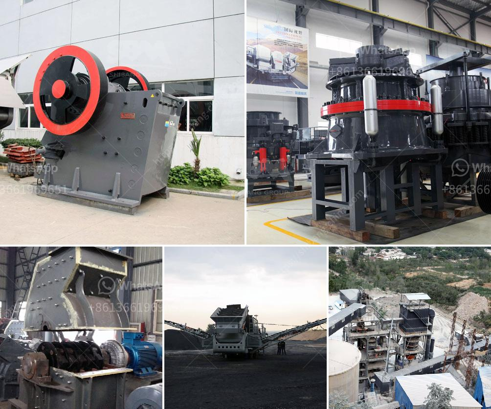

<h3>price high energy ball milling</h3>
The field of material science has witnessed remarkable advancements in recent years, paving the way for the development of innovative technologies and applications. In this regard, a technique known as high energy ball milling has emerged as a significant player, revolutionizing the way materials are processed and synthesized. In this article, we will explore the concept of high energy ball milling, its mechanisms, and its impact on material processing, along with discussing the factors that influence its pricing.

High energy ball milling is a top-down method that utilizes the mechanical energy generated by the collisions between grinding balls and the material being processed. The technique involves the use of a high-speed rotary mill, which applies mechanical forces to the material by repeatedly impacting it with the grinding balls. These collisions result in the creation of smaller particles and a rearrangement of atoms, leading to the synthesis of new materials and properties.

The advantages offered by high energy ball milling are numerous. First and foremost, the technique allows for the production of nanoscale materials, which possess unique properties compared to their bulk counterparts. Furthermore, high energy ball milling facilitates the efficient mixing of multiple components, enabling the synthesis of composites with tailored properties. It also enables solid-state reactions to occur at lower temperatures, reducing the risk of unwanted chemical reactions and allowing for the creation of new compounds. Finally, the technique offers a high degree of control and reproducibility, making it a suitable choice for both research and industrial applications.

However, the pricing of high energy ball milling can be a significant factor to consider. Several factors influence the cost of this technique, including the equipment and consumables required, the complexity of the material being processed, and the scale of the operation. High-energy ball mills, which are essential for this process, can be expensive, primarily depending on their capacity, speed, and construction quality. Moreover, the grinding balls used during the milling process can also contribute to the overall cost, with considerations such as material composition and durability impacting their price.

Another aspect to be considered in pricing high energy ball milling is the energy consumption associated with the technique. High energy ball milling requires a substantial amount of power for the rotary mill to operate efficiently. This energy consumption translates into electricity costs, which can vary depending on the region, the milling time, and the specific equipment used. Therefore, it is crucial to assess the energy requirements and factor them into the overall cost analysis.

In conclusion, high energy ball milling has revolutionized material processing and synthesis, offering a range of benefits and applications. The technique allows for the creation of nanostructured materials, the efficient mixing of components, and solid-state reactions at lower temperatures. Although the pricing of high energy ball milling can be influenced by various factors such as equipment, consumables, material complexity, and energy consumption, its potential for innovation and efficiency outweighs the costs. As the field of material science continues to evolve, high energy ball milling will remain a key player, shaping the future of material processing.
<h3>Contact us</h3><ul><li><strong>Whatsapp:&nbsp;<a href="https://wa.me/8613661969651">+8613661969651</a></strong></li><li><a href="https://swt.shibang-china.com/?git&amp;zhl&amp;price high energy ball milling"><strong>Online Service(chat now)</strong></a></li></ul><h3>Related</h3><ul><li><a href='crushing machine company.md'>crushing machine company</a></li><li><a href='clay crusher machine in india.md'>clay crusher machine in india</a></li><li><a href='company of stone crusher.md'>company of stone crusher</a></li><li><a href='how to make a business plan for crusher plant.md'>how to make a business plan for crusher plant</a></li><li><a href='enquiry about rock crusher.md'>enquiry about rock crusher</a></li></ul>