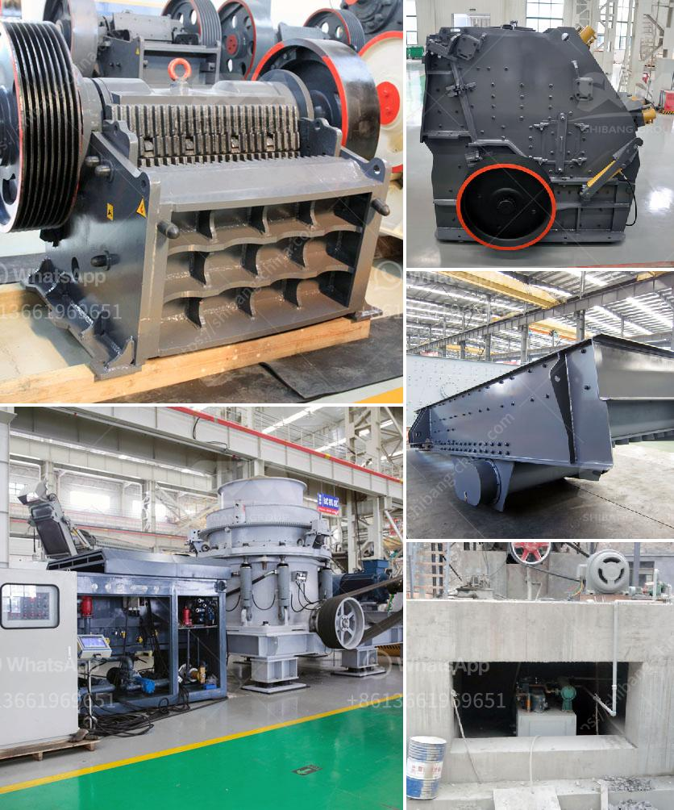

<h3>price of a mobile crusher</h3>
In the fast-paced world we live in, mobility has become a significant factor for many industries to thrive. Construction, mining, and quarrying are just a few examples of sectors benefiting from the convenience and efficiency brought by mobile crushers. These machines allow operators to process materials on-site, reducing the need for transportation and making it possible to work in remote areas. However, when considering these benefits, one crucial aspect that needs to be evaluated is the price of a mobile crusher.

The price of a mobile crusher can vary greatly depending on the size, power, and configuration of the machine. In general, higher capacity models tend to be more expensive, as they can handle larger quantities of material and offer higher production rates. Additionally, crushers equipped with advanced features and technologies can also come at a higher price point.

When assessing the price of a mobile crusher, it is essential to consider the specific needs and requirements of the project at hand. For instance, if the job entails processing large rocks or aggregate materials, a robust machine with a high horsepower rating would be necessary. On the other hand, smaller projects may require a compact crusher with lower power and size.

Another important factor affecting the price of a mobile crusher is the mobility feature itself. Some crushers are mounted on tracks, allowing them to move easily and efficiently across various terrains. This level of mobility comes at a higher cost compared to crushers that are stationary or require additional equipment for transportation.

Furthermore, additional features and technologies incorporated into the mobile crusher can also affect its price. For instance, advanced control systems and automation capabilities improve operational efficiency but also add to the overall cost. Similarly, safety features, such as remote control operation or anti-lock braking systems, increase the price but provide significant benefits in terms of safety and ease of use.

It is worth mentioning that the price of a mobile crusher should not be the sole determining factor when making a purchasing decision. Quality, reliability, and after-sales service are equally crucial aspects that need to be considered. Investing in a reputable brand with a strong track record ensures longevity and support throughout the lifespan of the machine.

In conclusion, the price of a mobile crusher depends on various factors, including size, power, configuration, mobility, and additional features. It is crucial to assess the specific requirements of the project at hand to determine the most suitable machine and balance it against the budget. Ultimately, the value that a mobile crusher brings to a business in terms of productivity, efficiency, and convenience outweighs the initial investment. With the right machine, industries can enjoy the benefits of on-site processing and cost-effective operations.
<h3>Contact us</h3><ul><li><strong>Whatsapp:&nbsp;<a href="https://wa.me/8613661969651">+8613661969651</a></strong></li><li><a href="https://swt.shibang-china.com/?git&amp;zhl&amp;price of a mobile crusher"><strong>Online Service(chat now)</strong></a></li></ul><h3>Related</h3><ul><li><a href='grinder mill powder singapore.md'>grinder mill powder singapore</a></li><li><a href='hammer mill for cerelaes.md'>hammer mill for cerelaes</a></li><li><a href='sand mining equipment manufacturers in south africa.md'>sand mining equipment manufacturers in south africa</a></li><li><a href='vibrating screens manufacturers india.md'>vibrating screens manufacturers india</a></li><li><a href='fly ash crusher unit india.md'>fly ash crusher unit india</a></li></ul>