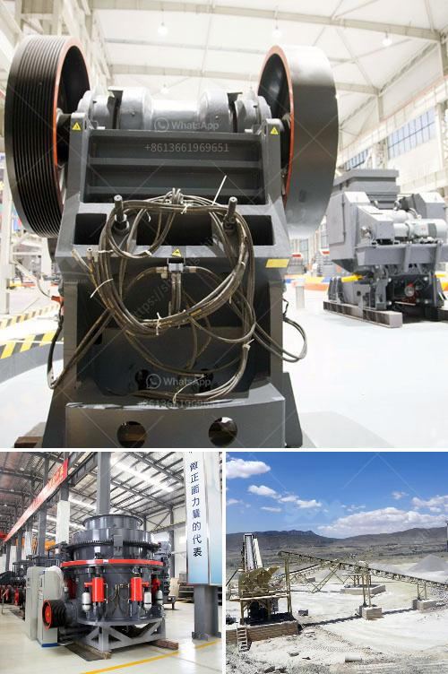

<h3>price of a stone crusher</h3>
The price of a stone crusher varies greatly depending on the type of machine you require. There are different kinds of crushers available in the market, including compression crushers and impact crushers. These two types of crushers are suitable for different industries, as they need to be used in different ways.

Compression crushers, such as gyratory crushers and cone crushers, squeeze rocks between two surfaces, one of which opens and closes like a jaw. These types of crushers are ideal for producing cubic-shaped aggregates that are suitable for many construction projects.

On the other hand, impact crushers use a hammer-like rotor to crush rocks and reduce them to smaller sizes. These crushers are ideal for producing fine aggregates for concrete and asphalt production.

When it comes to the price, as mentioned earlier, it can vary significantly depending on the type of crusher you need. Generally, larger machines are more expensive than smaller ones. The capacity of the crusher also plays a role in determining its price. Machines with higher capacities to crush a larger volume of rocks will cost more than those with lower capacities.

Another factor that affects the price of a stone crusher is the technology used. Some companies use advanced technologies to manufacture their crushers, which can increase the price. However, these machines often come with additional features that can improve efficiency and productivity.

Lastly, the brand of the stone crusher can also impact its price. Some well-known brands have a higher price tag due to their reputation and quality. However, lesser-known brands might offer similar features and functions at a lower cost.

In conclusion, the price of a stone crusher depends on various factors, such as the type of machine, capacity, technology, and brand. It is important to consider all these factors before making a purchase, as it will ensure that you get the most value for your money.
<h3>Contact us</h3><ul><li><strong>Whatsapp:&nbsp;<a href="https://wa.me/8613661969651">+8613661969651</a></strong></li><li><a href="https://swt.shibang-china.com/?git&amp;zhl&amp;price of a stone crusher"><strong>Online Service(chat now)</strong></a></li></ul><h3>Related</h3><ul><li><a href='price of a stone crusher.md'>price of a stone crusher</a></li><li><a href='vibrating screens manufacturers india.md'>vibrating screens manufacturers india</a></li><li><a href='robo sand making equipment rates in india.md'>robo sand making equipment rates in india</a></li><li><a href='sell crusher conica peru.md'>sell crusher conica peru</a></li><li><a href='stone mill grinder price.md'>stone mill grinder price</a></li></ul>