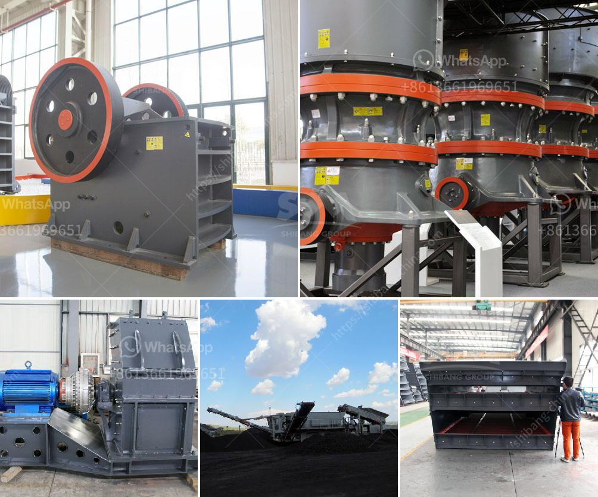

<h3>price of aggregate crusher machine in ethiopia</h3>
The price of aggregate crusher machine in Ethiopia has been a hot topic for many years. The market for aggregates in Ethiopia has been growing steadily, and the country's infrastructure is developing rapidly. This has led to an increase in demand for raw materials such as aggregates, resulting in a booming construction industry.

Aggregate crusher machines are widely used in Ethiopia, where the demand for these machines is constantly rising. As a leading manufacturer of crushing equipment in China, we not only provide a full range of crusher machines, including jaw crusher, cone crusher, hammer crusher, etc., but also offer a complete aggregate production line. This production line consists of various machines, such as vibrating feeder, jaw crusher, impact crusher, vibrating screen, and belt conveyor.

The price of the aggregate crusher machine in Ethiopia varies depending on different factors including the production capacity, technical requirements, and processing materials. For example, the price of a crusher with a capacity of 200 tons per hour will be different from that of a crusher with a capacity of 500 tons per hour. Some manufacturers offer special discounts for large orders, which can help reduce the overall cost.

In addition to the price of the machine itself, buyers should also consider the after-sales service provided by the manufacturer. A reliable manufacturer will offer comprehensive services, including installation, training, and regular maintenance. This ensures the smooth operation of the machine and maximizes its lifespan.

Overall, the price of the aggregate crusher machine in Ethiopia is competitive and attractive compared to other countries. With the continuous growth of the construction industry, there is a great demand for aggregate crusher machines in Ethiopia. Therefore, investing in an aggregate crusher machine in Ethiopia is a wise choice if you want to make your business profitable and sustainable.
<h3>Contact us</h3><ul><li><strong>Whatsapp:&nbsp;<a href="https://wa.me/8613661969651">+8613661969651</a></strong></li><li><a href="https://swt.shibang-china.com/?git&amp;zhl&amp;price of aggregate crusher machine in ethiopia"><strong>Online Service(chat now)</strong></a></li></ul><h3>Related</h3><ul><li><a href='300tph mobile crushing plant.md'>300tph mobile crushing plant</a></li><li><a href='2 meter concrete crusher.md'>2 meter concrete crusher</a></li><li><a href='stone crusher portable.md'>stone crusher portable</a></li><li><a href='used in vibrating screens.md'>used in vibrating screens</a></li><li><a href='mobile crusher on rent in chennai.md'>mobile crusher on rent in chennai</a></li></ul>