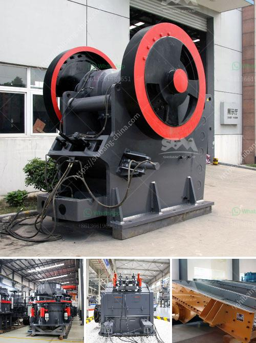

<h3>price of conveyor belt</h3>
Conveyor belts are an essential component of various industries, such as mining, food processing, manufacturing, and transportation. They play a crucial role in the efficient movement of materials, products, and goods. However, when considering the purchase of a conveyor belt, price becomes a significant factor to consider. In this article, we will explore the factors that influence the price of conveyor belts and the importance of finding the right balance between cost and quality.

One of the primary factors that affect the price of a conveyor belt is its material composition. Conveyor belts come in a variety of materials, including rubber, PVC, nylon, and steel. Each material has its advantages and disadvantages, and the choice depends on the specific requirements of the industry and application. For example, rubber belts are commonly used in mining and heavy-duty applications due to their durability and resistance to harsh environments. On the other hand, PVC belts are often chosen for their cost-effectiveness and easy cleaning properties in food processing industries. The material used significantly impacts the price, as more durable and specialized materials tend to be more expensive.

Another critical factor influencing the price is the width and length of the conveyor belt. Conveyor belts come in various sizes, and the cost tends to increase with larger dimensions. The width and length requirements depend on the specific application and the volume of materials to be transported. A wider and longer belt may require more materials and manufacturing processes, leading to a higher price.

Moreover, the type of conveyor system required also contributes to the overall cost. There are numerous types of conveyor systems available, such as flat belt, modular belt, roller, and overhead conveyors. Each system has its unique features and benefits, but they also vary in terms of complexity and price. For instance, while a basic flat belt conveyor system may be cost-effective for simple applications, a more sophisticated modular belt conveyor, with added features like diverters or automated sorting mechanisms, can be more expensive due to its increased complexity and functionality.

Furthermore, additional features and accessories can also impact the price. Various components, such as motors, speed controllers, sensors, and safety devices, may be required to enhance the performance, efficiency, and safety of the conveyor system. These additional features add to the overall cost, but they are essential for optimizing productivity and meeting industry standards.

It is important to note that while price is a crucial factor, it should not be the sole determining factor when purchasing a conveyor belt. Quality, reliability, and after-sales support should also be taken into consideration to ensure a long-lasting, efficient, and cost-effective investment. Low-quality conveyor belts may have a lower upfront price but might result in frequent breakdowns, increased maintenance costs, and prolonged downtime, leading to overall higher expenses in the long run.

In conclusion, the price of conveyor belts is influenced by several factors, including the material composition, width and length, type of conveyor system, and additional features. It is crucial to carefully assess the specific requirements and limitations of the industry/application to choose the right conveyor belt within the desired price range. However, it is equally important to prioritize quality and reliability to ensure a successful and efficient operation in the long term.
<h3>Contact us</h3><ul><li><strong>Whatsapp:&nbsp;<a href="https://wa.me/8613661969651">+8613661969651</a></strong></li><li><a href="https://swt.shibang-china.com/?git&amp;zhl&amp;price of conveyor belt"><strong>Online Service(chat now)</strong></a></li></ul><h3>Related</h3><ul><li><a href='hydro classifier silica sand.md'>hydro classifier silica sand</a></li><li><a href='stone crusher sale in peru.md'>stone crusher sale in peru</a></li><li><a href='stone crusher in malaysia.md'>stone crusher in malaysia</a></li><li><a href='manufacture of conveyor belts.md'>manufacture of conveyor belts</a></li><li><a href='stone crusher kapasitas 300 400 ton jam.md'>stone crusher kapasitas 300 400 ton jam</a></li></ul>