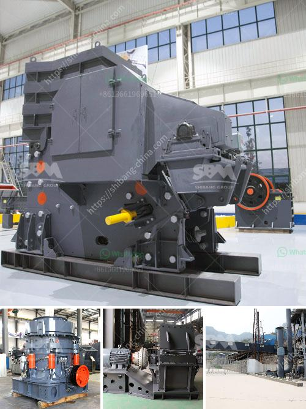

<h3>price of copper smelting plant</h3>
Copper smelting plants play a vital role in the copper industry, as they are responsible for the conversion of raw copper ore into more refined copper products. However, establishing a copper smelting plant requires a significant investment due to various factors. In this article, we will explore the price range of building a copper smelting plant, taking into account the key components and considerations.

The cost of a copper smelting plant can vary greatly depending on its size and complexity. A small-scale plant, with a smelting capacity of around 50,000 tonnes per year, may cost around $10 million, whereas a larger-scale plant with a capacity of several hundred thousand tonnes per year can cost upwards of $100 million.

One of the main factors influencing the price is the technology used in the smelting process. Traditional smelting methods, such as reverberatory furnaces, are more cost-effective but can be less energy-efficient and have higher environmental impacts. On the other hand, modern and more advanced technologies, such as flash smelting or oxygen-enriched flash smelting, are associated with higher upfront costs but offer better energy efficiency and reduced environmental emissions.

Other significant cost factors to consider are the size and location of the plant. Larger plants generally require more land, raw materials, and labor, resulting in higher costs. Additionally, the location of the plant is critical for accessibility to raw materials and markets, as transportation costs can have a considerable impact on the overall investment.

Moreover, a critical aspect that affects the plant's price is the cost of environmental compliance. Governments and environmental regulations demand smelting plants to adhere to stringent emission standards and invest in pollution control technologies. These additional requirements can drive up the price of the plant significantly.

In conclusion, the price of a copper smelting plant is influenced by several factors, including size, technology, location, and environmental compliance. Small-scale plants may cost around $10 million, while larger-scale plants can exceed $100 million. It is crucial for investors to carefully assess their needs, market conditions, and environmental considerations before committing to such a significant investment. Only by weighing these factors can one determine which balance of cost and efficiency is most suitable for their smelting operation.
<h3>Contact us</h3><ul><li><strong>Whatsapp:&nbsp;<a href="https://wa.me/8613661969651">+8613661969651</a></strong></li><li><a href="https://swt.shibang-china.com/?git&amp;zhl&amp;price of copper smelting plant"><strong>Online Service(chat now)</strong></a></li></ul><h3>Related</h3><ul><li><a href='mill grinding machine for sale.md'>mill grinding machine for sale</a></li><li><a href='concrete crusher for sale in nigeria.md'>concrete crusher for sale in nigeria</a></li><li><a href='open cast mining china clay process.md'>open cast mining china clay process</a></li><li><a href='cement plant ataustralia.md'>cement plant ataustralia</a></li><li><a href='raymond mill manufacturers in india.md'>raymond mill manufacturers in india</a></li></ul>