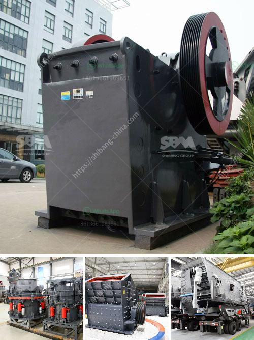

<h3>price of crusher</h3>
When it comes to investing in a crushing machine or equipment, there are several factors to consider. One of the most crucial elements is the price of the crusher. To make an informed decision, it is essential to understand the different factors that influence the pricing of crushers. This article will delve into these factors, helping potential buyers find the right investment for their needs.

The first factor that affects the price of a crusher is its capacity. Crushers come in various sizes, from small handheld units to large industrial machineries. The higher the capacity of the crusher, the more expensive it will be. This is because larger crushers can process more materials in a shorter period, making them ideal for heavy-duty operations. However, smaller crushers can still provide efficient crushing for smaller projects at a more affordable price.

Another factor that influences the price of a crusher is its quality and durability. A well-built and sturdy crusher is likely to have a higher price tag as it is made from high-quality materials and is designed to withstand heavy use. These crushers often come with additional features like noise reduction and dust suppression systems, which add to their price. However, investing in a high-quality crusher ensures longevity and minimal downtime, which translates to increased productivity and cost savings in the long run.

The type of crusher also affects its price. There are several types of crushers available, each designed for specific crushing purposes. Jaw crushers, cone crushers, and impact crushers are some of the popular choices. Jaw crushers are ideal for primary crushing, cone crushers are suitable for secondary and tertiary crushing, and impact crushers excel at producing cubical-shaped aggregates. The price of each type varies depending on its performance capabilities and unique features.

Additionally, the brand reputation and after-sales support of a crusher manufacturer can impact its price. Well-established manufacturers with a proven track record often charge a premium for their products. This is because they have invested heavily in research and development, ensuring that their crushers are innovative, reliable, and efficient. These manufacturers also provide excellent after-sales support, including spare parts availability and prompt service, which adds value to their products.

Lastly, the location and distribution network of a crusher supplier influence its price. Suppliers located near the buyer can offer competitive prices due to reduced transportation costs. Furthermore, suppliers with a wide distribution network can negotiate better deals with shipping companies, enabling them to offer more affordable pricing to customers.

In conclusion, the price of a crusher is influenced by various factors, including its capacity, quality, type, brand reputation, and location. It is crucial to carefully analyze these factors to find the right investment that meets your crushing needs and budget. While it may be tempting to opt for the cheapest option available, it is important to consider the long-term benefits and cost savings offered by a high-quality and durable crusher. Researching multiple suppliers, comparing prices, and seeking recommendations from industry experts can help potential buyers make an informed decision and find the best crusher at the right price.
<h3>Contact us</h3><ul><li><strong>Whatsapp:&nbsp;<a href="https://wa.me/8613661969651">+8613661969651</a></strong></li><li><a href="https://swt.shibang-china.com/?git&amp;zhl&amp;price of crusher"><strong>Online Service(chat now)</strong></a></li></ul><h3>Related</h3><ul><li><a href='manufacturer of industrial hammer mill.md'>manufacturer of industrial hammer mill</a></li><li><a href='jaw crusher used india.md'>jaw crusher used india</a></li><li><a href='coal grinding mill in bhopal india.md'>coal grinding mill in bhopal india</a></li><li><a href='talc powder mill suppliers in china.md'>talc powder mill suppliers in china</a></li><li><a href='jaw crushers for sale in uganda.md'>jaw crushers for sale in uganda</a></li></ul>