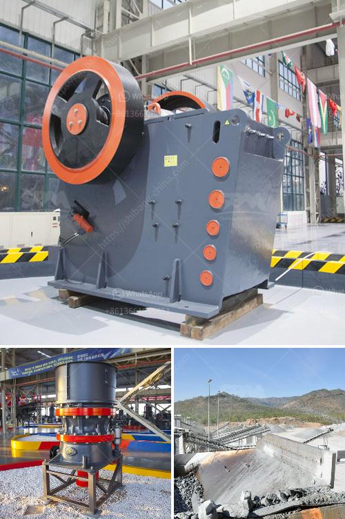

<h3>price of crushers and crushers</h3>
The price of crushers is an important factor in the purchasing process of customers. However, because of the wide range of crushers available in the market, it is not easy to choose the right one. Therefore, customers need to take multiple factors into account when choosing the crusher, including the capacity, power consumption, price, and after-sales service of the crusher.

The price range of crushers varies widely, from hundreds of thousands to millions. Currently, Chinese crushers are generally priced at around one million. The price is relatively low compared with those produced in other countries. Besides, the price of crushers with different model specifications is also different.

When purchasing the crusher, the customer needs to know the size of the stone to be crushed. If the size of the stone is large, the jaw crusher can be used as the primary crusher, and the cone crusher is often used for secondary crushing. In addition, the final product particle size is also a factor to consider. If the particle size is large and the hardness is high, a single-stage hammer crusher can be considered, which can achieve one-time crushing with a simple structure, high production capacity, and low operating cost.

In general, the price of crushers with a large crushing ratio, a high yield, and uniform product size is relatively high. However, the cost performance of the crusher should also be taken into account. Some crushers may have a high price but not necessarily high quality. Customers should conduct a comprehensive understanding of the crusher manufacturer, product quality, and after-sales service before purchasing.

Furthermore, the crusher power consumption is an important factor affecting the overall operating cost. Some crushers consume a large amount of electricity, which increases the cost of production. Therefore, customers should choose crushers with low power consumption as much as possible to reduce production costs.

Additionally, after-sales service is also a key point to consider when choosing a crusher. The crusher is a machine that will frequently encounter various problems during operation, so a good after-sales service team is necessary to solve these problems in time. A reliable after-sales service team can not only reduce the downtime of the equipment but also guarantee the continuous and stable production of the customer.

To conclude, the price of crushers is influenced by various factors such as capacity, power consumption, size of the stone to be crushed, and after-sales service. Customers need to consider their specific needs and budget when purchasing a crusher. It is crucial to choose a crusher with good cost performance, low power consumption, and reliable after-sales service to ensure long-term and efficient production.
<h3>Contact us</h3><ul><li><strong>Whatsapp:&nbsp;<a href="https://wa.me/8613661969651">+8613661969651</a></strong></li><li><a href="https://swt.shibang-china.com/?git&amp;zhl&amp;price of crushers and crushers"><strong>Online Service(chat now)</strong></a></li></ul><h3>Related</h3><ul><li><a href='what is the best granite crusher machine.md'>what is the best granite crusher machine</a></li><li><a href='graphite mining process.md'>graphite mining process</a></li><li><a href='aggregate crushers south africa.md'>aggregate crushers south africa</a></li><li><a href='mini cement plant project report.md'>mini cement plant project report</a></li><li><a href='cement plant process flow diagram ppt.md'>cement plant process flow diagram ppt</a></li></ul>