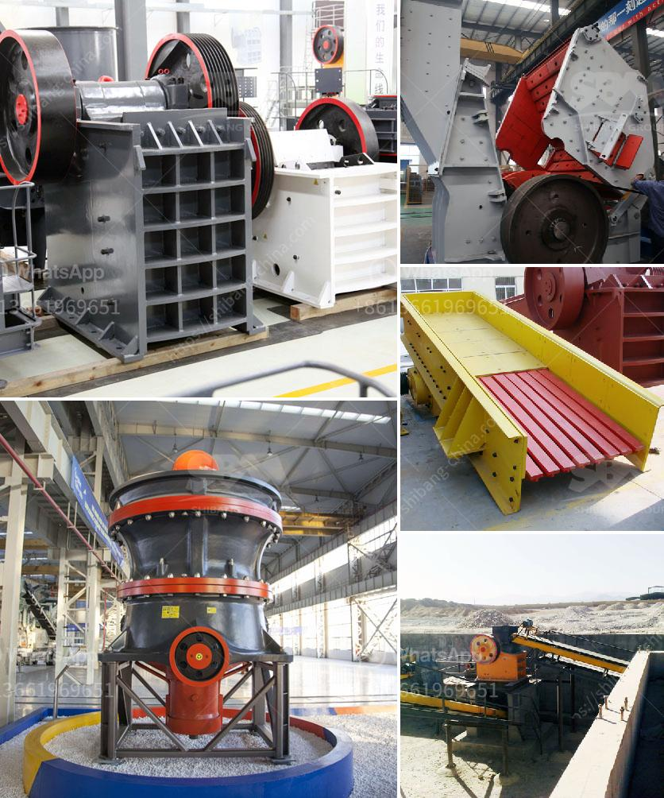

<h3>price of mobile crushing plant</h3>
Mobile crushing plants have become a common sight in quarries and mines around the world, thanks to their numerous advantages over traditional stationary crushing plants. Due to their compact size, ease of transportation, and ability to perform at high levels even in remote locations, these versatile machines have gained massive popularity. However, one critical aspect that potential buyers need to consider is the cost of mobile crushing plants. In this article, we will delve into the price dynamics of mobile crushing plants, focusing on factors that influence their cost range.

The primary factor that determines the cost of a mobile crushing plant is its production capacity. Generally, a higher production capacity implies a more robust and powerful machine, capable of processing larger quantities of materials. However, this increased capacity comes at a higher price point. Buyers need to assess their specific requirements and analyze the expected output before settling on a crushing plant with an appropriate production capacity.

The features and specifications of a mobile crushing plant also play a significant role in its pricing. Advanced features such as automated control systems, remote monitoring, and troubleshooting functionalities may drive up the cost of the plant compared to basic models. Buyers should prioritize features that align with their operational needs while considering the impact on the overall budget.

One of the key advantages of mobile crushing plants is their ability to be easily transported from one site to another. However, increased mobility often comes at a higher cost. Mobile crushing plants can be categorized into two main types: tracked and wheeled. Tracked plants offer enhanced maneuverability on rough terrains but may cost more due to the sophisticated tracking mechanisms. On the other hand, wheeled plants are suitable for short-distance transportation and offer a slightly lower initial investment.

Brand reputation and after-sales support have a direct impact on the price of a mobile crushing plant. Established manufacturers with a solid reputation in the industry tend to offer higher-quality products, backed by comprehensive customer service. Accordingly, their prices might be slightly higher compared to lesser-known manufacturers or new market entrants offering similar functionalities.

The geographical location where the mobile crushing plant will be delivered can influence its cost due to transportation expenses. Furthermore, import/export duties, if applicable, can significantly affect the final price. Buyers should consider these additional costs while planning their budget.

When evaluating the price of a mobile crushing plant, it is essential to consider various factors such as production capacity, features, mobility, brand reputation, and after-sales support. By carefully assessing these aspects and comparing multiple options, buyers can make an informed decision that aligns with their budget and operational needs. Ultimately, investing in a mobile crushing plant that strikes the right balance between cost and performance can lead to improved efficiency, higher productivity, and long-term profitability.
<h3>Contact us</h3><ul><li><strong>Whatsapp:&nbsp;<a href="https://wa.me/8613661969651">+8613661969651</a></strong></li><li><a href="https://swt.shibang-china.com/?git&amp;zhl&amp;price of mobile crushing plant"><strong>Online Service(chat now)</strong></a></li></ul><h3>Related</h3><ul><li><a href='vibrating screen in egypt.md'>vibrating screen in egypt</a></li><li><a href='process of cement.md'>process of cement</a></li><li><a href='copper manufacturing process.md'>copper manufacturing process</a></li><li><a href='complete crushing plant solutions prices.md'>complete crushing plant solutions prices</a></li><li><a href='process of making talcum powder.md'>process of making talcum powder</a></li></ul>