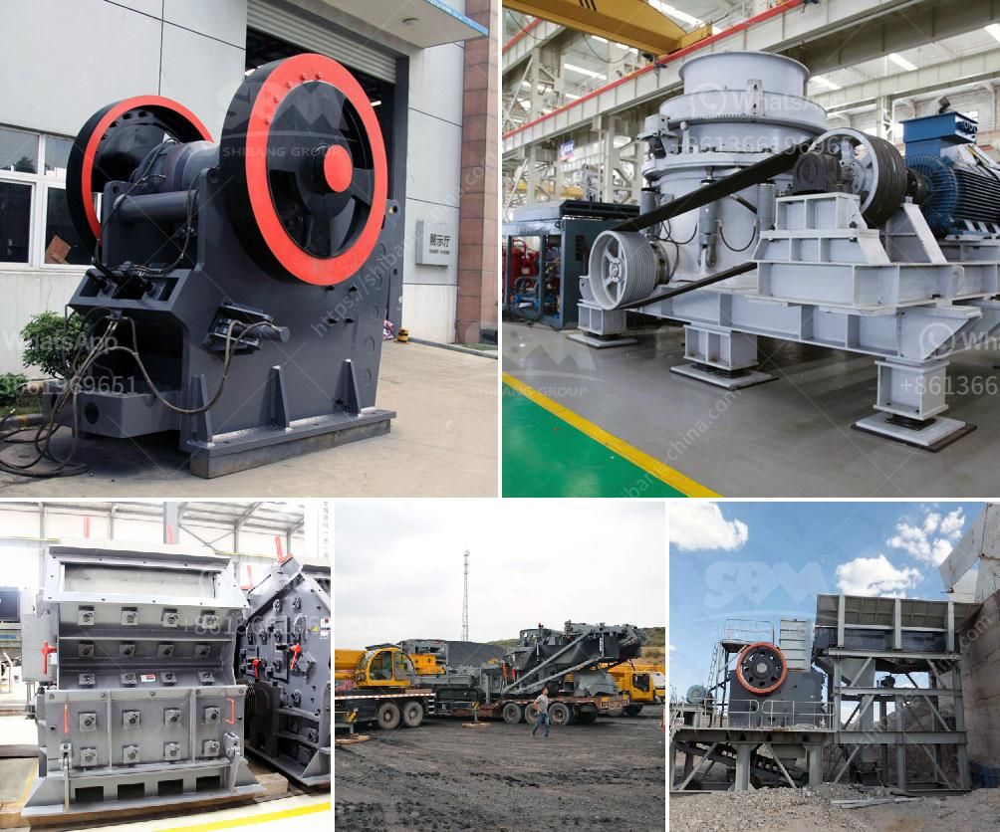

<h3>price of portable stonecrusher</h3>
Stone crushers have become an indispensable equipment in the mining and construction industry. They are used extensively in various applications such as aggregate production, recycling, and quarrying. However, the price of these machines can vary widely depending on several factors. In this article, we will delve into the price range of portable stone crushers and explore the factors that influence their cost.

Portable stone crushers are mobile or semi-mobile crushers that can be carried from one site to another using a truck or similar transportation method. Portable stone crushers are often used for crushing rocks or ore in mining, construction, and other industries. Moreover, portable stone crushers are also popular for recycling applications.

When it comes to prices, portable stone crushers can range in price from around $30,000 to upwards of $700,000. The exact price depends on the specific features and capabilities of the machine. Some high-end portable stone crushers may even exceed the $1 million mark.

Several factors contribute to the price range of portable stone crushers. Firstly, the type of crusher plays a crucial role in determining its price. Jaw crushers are usually more expensive than impact crushers, for example. Other types such as cone crushers or vertical shaft impactors (VSI) might also have different price ranges.

Secondly, the features and capabilities of the portable stone crusher influence its price. Higher-performance machines with advanced technology, such as improved crushing efficiencies, automation, or remote control capabilities, tend to have higher price tags. Additionally, advanced safety features or environmental compliance systems can also impact the price.

Thirdly, the brand and reputation of the manufacturer affect the price of portable stone crushers. Well-established brands with a history of producing reliable and durable crushers often charge a premium compared to lesser-known or newer brands. The price reflects the quality, reliability, and after-sales service provided by the manufacturer.

Furthermore, local economic conditions and demand-supply dynamics also play a role in determining the price of portable stone crushers. In areas where demand for these machines is high but supply is limited, prices can be significantly higher. Similarly, local taxation and import duties can increase the overall cost of acquiring a portable stone crusher.

It is worth mentioning that prices also vary based on the purchasing method. Buying directly from the manufacturer may be cheaper compared to purchasing from a dealer or intermediary. Moreover, leasing or renting options may provide a more affordable alternative for some businesses.

In conclusion, the price of portable stone crushers can fluctuate significantly depending on various factors. These factors include the type of crusher, its features and capabilities, the brand reputation, local economic conditions, and the purchasing method. It is crucial for businesses to consider their specific requirements and budget constraints when searching for a portable stone crusher, ensuring they strike a balance between price, performance, and reliability.
<h3>Contact us</h3><ul><li><strong>Whatsapp:&nbsp;<a href="https://wa.me/8613661969651">+8613661969651</a></strong></li><li><a href="https://swt.shibang-china.com/?git&amp;zhl&amp;price of portable stonecrusher"><strong>Online Service(chat now)</strong></a></li></ul><h3>Related</h3><ul><li><a href='ultra conveyor belts usa.md'>ultra conveyor belts usa</a></li><li><a href='vibrating screens manufacturers in south africa.md'>vibrating screens manufacturers in south africa</a></li><li><a href='copper ore ball mill.md'>copper ore ball mill</a></li><li><a href='price of stone crushing machine.md'>price of stone crushing machine</a></li><li><a href='self healing process of limestone.md'>self healing process of limestone</a></li></ul>