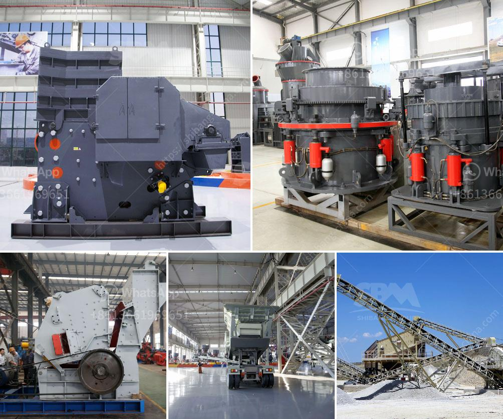

<h3>price of rollers for conveyor belts</h3>
The price of rollers for conveyor belts is a key consideration for businesses in various industries, including manufacturing, mining, and logistics. Conveyor belts are widely used for transporting goods and materials efficiently and safely, and the rollers play a crucial role in their smooth operation. This article will explore the factors influencing the price of conveyor belt rollers and provide insights into how businesses can make cost-effective decisions.

One of the primary influencer of conveyor belt roller prices is the material used for manufacturing them. Different materials have varying durability and performance characteristics, resulting in varying costs. Steel rollers are the most commonly used type, offering excellent strength and reliability. They are durable and can withstand heavy loads and impact. Steel rollers can be either galvanized or coated to enhance corrosion resistance, thereby increasing their longevity. These features make steel rollers a popular choice among businesses. However, their higher material and manufacturing cost typically translates into a higher selling price.

Apart from steel, there are other key materials used for roller production. Aluminum rollers are lightweight and offer good resistance to corrosion, making them suitable for applications where weight minimization is crucial, such as in airport baggage handling systems. Plastic rollers, on the other hand, are cost-effective and lightweight, but they may not be suitable for heavy-duty applications due to reduced strength and durability.

The size and dimensions of the rollers also affect their price. The length, diameter, and wall thickness of a roller dictate the amount of material required for its manufacturing, which in turn influences the cost. Larger rollers generally require more material and are manufactured using more complex machinery, resulting in higher production costs. Therefore, businesses need to carefully assess their requirements to find the optimal balance between roller size and price.

Another factor impacting the price of conveyor belt rollers is customization. Different businesses have unique requirements in terms of roller design, shape, and features, such as bearing type and load capacity. Customized rollers often require additional engineering, tooling, and setup, resulting in higher production costs. However, customized rollers can offer benefits such as improved performance, reduced maintenance, and better compatibility with specific conveyor systems. Businesses should evaluate their particular needs and weigh the benefits against the higher prices associated with customization.

In addition to material, size, and customization, other aspects can affect roller prices. These include the manufacturing process, technological innovations, and market dynamics. For example, advancements in roller manufacturing techniques, such as automated production lines, can enhance efficiency and reduce costs. Similarly, market competition and supply-demand dynamics can also influence prices.

To ensure cost-effectiveness, businesses should consider several strategies when purchasing conveyor belt rollers. Firstly, conducting thorough market research and comparing prices from different suppliers can help identify the best deals. Additionally, collaborating with suppliers and discussing long-term requirements can lead to volume discounts or favorable terms. It is also crucial to evaluate the overall value proposition, considering factors like warranty, maintenance requirements, and after-sales service.

In conclusion, the price of rollers for conveyor belts depends on various factors, including material, size, customization, manufacturing process, and market dynamics. By understanding these factors and considering their specific requirements, businesses can make informed decisions to strike a balance between cost and quality, ensuring smooth and efficient conveyor belt operations.
<h3>Contact us</h3><ul><li><strong>Whatsapp:&nbsp;<a href="https://wa.me/8613661969651">+8613661969651</a></strong></li><li><a href="https://swt.shibang-china.com/?git&amp;zhl&amp;price of rollers for conveyor belts"><strong>Online Service(chat now)</strong></a></li></ul><h3>Related</h3><ul><li><a href='silica sand mines in maharashtra.md'>silica sand mines in maharashtra</a></li><li><a href='proposal for cement plant crusher.md'>proposal for cement plant crusher</a></li><li><a href='raymond mills mexico.md'>raymond mills mexico</a></li><li><a href='granite crushing companies.md'>granite crushing companies</a></li><li><a href='price of conveyor belt.md'>price of conveyor belt</a></li></ul>