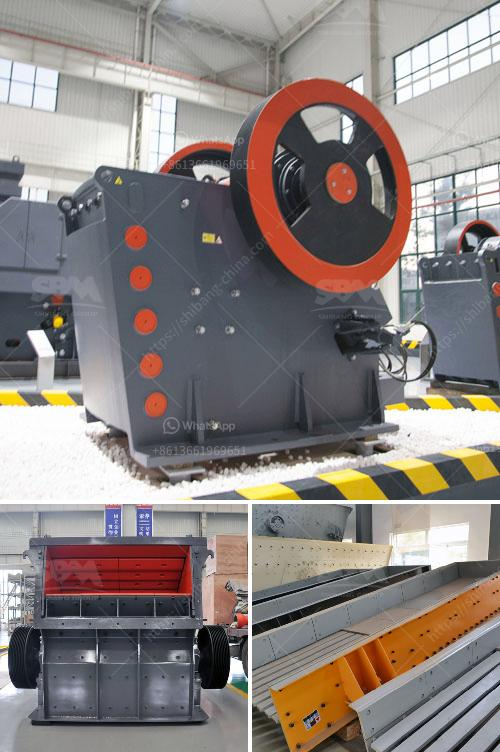

<h3>price of smallest chippings crusher plant</h3>
When it comes to investing in a chipping crusher plant, a significant consideration is the price. With various sizes and models available, it's essential to find the right one for your needs. In this article, we will explore the price of the smallest chipping crusher plant and its features.

The smallest chipping crusher plant is usually designed for small to medium-sized projects. These plants are ideal for crushing and recycling various materials, such as concrete, bricks, stones, and more. Despite their smaller size, they offer impressive performance and efficiency.

The price of the smallest chipping crusher plant can vary depending on several factors. The first consideration is the capacity. These plants can range from 30 to 500 tons per hour, allowing flexibility to choose the one that meets your production needs. As the capacity increases, so does the price.

Additionally, the type of materials you plan to crush plays a role in determining the price. Some plants are designed for specific materials, such as stone or concrete. If you require a plant that can handle a variety of materials, it may be more expensive.

Another factor that affects the price is the brand and reputation of the manufacturer. Well-established manufacturers with a proven track record usually offer higher-priced plants. However, investing in a reputable brand often ensures better quality and durability, reducing maintenance costs in the long run.

Apart from the initial cost, it's crucial to consider the operating and maintenance expenses. These smaller chipping crusher plants typically run on diesel engines, requiring fuel and regular maintenance. It's essential to estimate these ongoing costs to include them in your budget.

Furthermore, the price may also include additional features that enhance the plant's efficiency and reliability. Some plants come with a vibrating feeder that ensures a continuous flow of materials, reducing downtime. Others have a magnetic separator to remove any metal impurities from the crushed material. Although these features may increase the price, they can improve productivity and output quality.

It's crucial to compare prices from different manufacturers to find the best deal. However, price should not be the sole determining factor. Consider the overall quality, reputation, durability, and after-sales service offered by the manufacturer. Investing in a well-built and reliable chipping crusher plant can save you money in the long term.

In conclusion, the price of the smallest chipping crusher plant can vary depending on factors such as capacity, material type, brand, and additional features. It's essential to consider not only the initial cost but also ongoing operating and maintenance expenses. Comparing prices from reputable manufacturers and evaluating the overall quality will help you make an informed decision. Remember that investing in a reliable and efficient plant can lead to higher productivity and cost savings in the long run.
<h3>Contact us</h3><ul><li><strong>Whatsapp:&nbsp;<a href="https://wa.me/8613661969651">+8613661969651</a></strong></li><li><a href="https://swt.shibang-china.com/?git&amp;zhl&amp;price of smallest chippings crusher plant"><strong>Online Service(chat now)</strong></a></li></ul><h3>Related</h3><ul><li><a href='small scale tantalum milling machine supplier.md'>small scale tantalum milling machine supplier</a></li><li><a href='price of stone crusher in philippines.md'>price of stone crusher in philippines</a></li><li><a href='compact concrete crusher.md'>compact concrete crusher</a></li><li><a href='jaw impact crusher poland.md'>jaw impact crusher poland</a></li><li><a href='stone crushing equipment available in northern cape.md'>stone crushing equipment available in northern cape</a></li></ul>