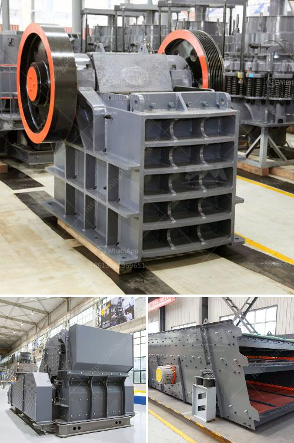

<h3>price of stone crusher capacity 200 tons per hour</h3>
Stone crusher is a machine designed to reduce large rocks into smaller rocks, gravel, or rock dust. Crushers may be used to reduce the size, or change the form, of waste materials so they can be more easily disposed of or recycled, or to reduce the size of a solid mix of raw materials, so that pieces of different composition can be differentiated.

With a capacity of 200 tons per hour, the price of stone crusher is about $90,000 to $120,000. A set of 200 tons stone crusher includes vibrating feeder + jaw crusher + cone crusher + vibrating screen + belt conveyor and the sand making machine.

Complete set of gravel production line, including vibration feeder, jaw crusher, impact crusher, cone crusher, sand making machine and conveyor, etc., will get a price discount. Because the customer’s demand for stone crushing is different, the production capacity of each equipment needed is different.

According to the requirements of customers for gravel equipment, the price per hour of stone crusher with different production capacity is different. If you want to know about the detailed price of equipment and other related information, you can consult online customer service for free. We will provide you with a full set of solutions and offer you the most cost-effective equipment in the market.
<h3>Contact us</h3><ul><li><strong>Whatsapp:&nbsp;<a href="https://wa.me/8613661969651">+8613661969651</a></strong></li><li><a href="https://swt.shibang-china.com/?git&amp;zhl&amp;price of stone crusher capacity 200 tons per hour"><strong>Online Service(chat now)</strong></a></li></ul><h3>Related</h3><ul><li><a href='olx used crusher machines.md'>olx used crusher machines</a></li><li><a href='rubber conveyor belt manufacturers in turkey.md'>rubber conveyor belt manufacturers in turkey</a></li><li><a href='stone dust processing machine.md'>stone dust processing machine</a></li><li><a href='chrome ore mining plant sudan.md'>chrome ore mining plant sudan</a></li><li><a href='industrial hammer mill.md'>industrial hammer mill</a></li></ul>