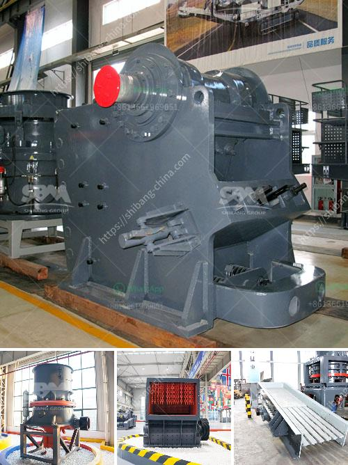

<h3>price of stone crusher in philippines</h3>
The price of stone crusher in the Philippines has always been a concern of customers. Many customers come to visit our company in person when they need to buy a stone crusher. Our company has been adhering to the principle of customer first, providing customers with high-quality products and excellent service. With the development of the mining machinery industry and the increasing demand for stone crushers in the Philippines, we have become one of the leading manufacturers and suppliers of stone crushers in the country.

The price of stone crusher in the Philippines has soared in recent years. With the continuous development of the economy and the increase in infrastructure construction, the demand for stone crushers is growing. However, the price of stone crushers varies greatly. According to different manufacturers or suppliers, the price of stone crushers ranges from thousands to tens of millions of pesos. The price of stone crushers in the Philippines depends on the following factors:

1. Manufacturer: Different manufacturers have different production costs and pricing methods. The prices offered by large-scale manufacturers are often higher than those offered by small and medium-sized manufacturers. However, large-scale manufacturers usually have relatively high production capacity, product quality assurance, and comprehensive after-sales service, which can provide customers with a better buying experience.

2. Specifications: Stone crushers with different specifications have different prices. Crushers with larger processing capacities and higher output requirements are generally more expensive. Similarly, crushers with more advanced technology and better performance are usually more expensive. Customers should choose the appropriate model according to their actual needs and budget.

3. Market demand: The market demand for stone crushers also affects their prices. If the demand for stone crushers is high, the price will naturally increase. On the contrary, if the demand is low, the price may be relatively low or even discounted. Customers should pay attention to market changes and make purchases at the right time to obtain better price/performance ratio.

4. Raw material costs: The cost of raw materials is an important factor affecting the price of stone crushers. The price of steel, motors, bearings, and other key components fluctuates with the market, which will affect the cost and pricing of stone crushers. Customers should pay attention to changes in raw material prices and their impact on the overall price of stone crushers.

In conclusion, the price of stone crusher in the Philippines is affected by various factors, such as manufacturer, specifications, market demand, and raw material costs. It is important for customers to carefully compare different suppliers and products, consider their actual needs, and budget, and make rational choices. By doing so, customers can get high-quality stone crushers at reasonable prices and maximize the value of their investment. Our company is committed to providing customers with cost-effective stone crushers and excellent after-sales service, welcoming customers to visit our company or contact us for more information.
<h3>Contact us</h3><ul><li><strong>Whatsapp:&nbsp;<a href="https://wa.me/8613661969651">+8613661969651</a></strong></li><li><a href="https://swt.shibang-china.com/?git&amp;zhl&amp;price of stone crusher in philippines"><strong>Online Service(chat now)</strong></a></li></ul><h3>Related</h3><ul><li><a href='used screens crushers for coal uk.md'>used screens crushers for coal uk</a></li><li><a href='used stone crusher sale in ethiopia.md'>used stone crusher sale in ethiopia</a></li><li><a href='calcium silicone crushers.md'>calcium silicone crushers</a></li><li><a href='slag crushing plant manufacturers in india.md'>slag crushing plant manufacturers in india</a></li><li><a href='concrete crusher for sale in nigeria.md'>concrete crusher for sale in nigeria</a></li></ul>