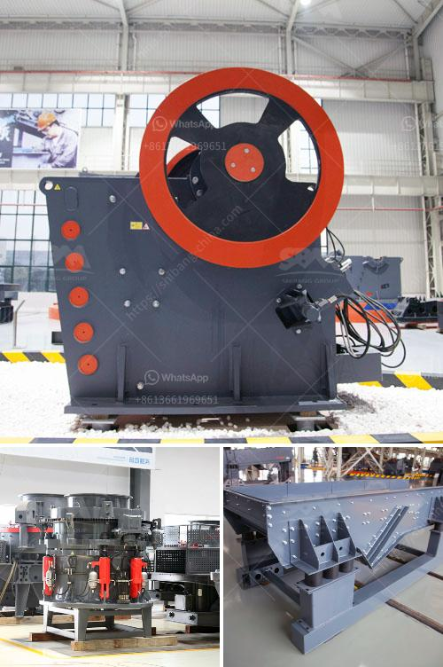

<h3>price of stone crusher machine in nigeria</h3>
According to the recent development in Nigeria, the stone crusher machine has helped the local customers make high profits. So, the stone crusher machine is widely utilized in Nigeria. Here, we focus on the stone crusher machine in Nigeria.

As one of SBM's flagship products, the stone crusher machine has been extensively used in this country for many years. The medium crusher is a kind of grinder, mainly consists of frame, hopper, blades, grinding blocks, wind conveying device, etc., which are widely used in various mining crushing, construction aggregate processing and other fields.

The price of stone crusher machines in Nigeria always tends to be high provided by dealers who are specialized in producing mining machinery equipment. In Nigeria, the crusher manufacturers have helped local customers produce a series of crushers used in local mineral ore mining site, including gold ore, silver ore, copper ore, granite, limestone, basalt, etc.

There are many types of stone crusher machines in the market, such as jaw crusher, counterattack crusher, vertical impact crusher, hydraulic cone crusher, hammer crusher, roll crusher, compound crusher, cone crusher, the two-stage crusher, gyratory crusher, mobile crusher and so on.

Different stone crusher machines are suitable for different crushing situations. They are widely used in basalt crushing, granite crushing, limestone crushing, river pebble crushing and various kinds of ore crushing projects.

High efficiency and energy saving: The crusher machines are carefully designed to provide customers with high efficiency and low energy consumption. It has been widely used in quarries, recycling and mining operations in Nigeria.

High quality materials: The materials for the crusher machines in Nigeria are made of high-quality materials. That is to say, they can prolong the service life and keep the stable operation of the machine in continuous production.

Safe to operate: The stone crusher machine can operate smoothly and safely, without causing accidents. It has reliable performance and is easy to maintain and repair.

Low maintenance costs: The wearing parts of the stone crusher machine are made of high-quality materials with good wear resistance, which can reduce the maintenance costs effectively.

Simple operation: The crusher machines are easy to operate and convenient to use. It only requires a few operators to complete the operation and maintenance tasks.

The price of stone crusher machines in Nigeria depends on the stone crusher machines' types and quantities. As the looting and vandalism caused by armed gangs in various regions have hindered the production of stone crushers in Nigeria.

Factors such as government support and high demand have pushed the price of stone crushers to new highs. With prices ranging from $15,000 to $50,000, the crushers are said to be environmentally friendly.

Some of the crushers, mainly used in quarries, have lower prices. However, the overall price of the crusher is still higher than fixed machine, so for customers, it is much more cost-effective to use mobile crushing plant.

Mobile stone crusher machine eliminates the cumbersome operation of carrying crushing materials from one place to another. The stone crusher machine can process materials with a side length of 100-500 mm, a compressive strength of up to 350 MPa, and a crushing ratio of 6 or higher, which is more suitable for crushing medium and hard materials such as limestone, cement clinker, and shale.

It is widely used in mining, metallurgy, construction, highway, railway, water conservancy, chemical industry, and other industries. Mobile stone crusher machines are more convenient because of the mobility and can be directly opened to the crushing site for operation, reducing the transportation cost of materials.

The price of mobile stone crusher machines varies with the crusher types and quantities. For example, the price of a small jaw crusher could be different from gyratory crusher, cone crusher, hammer crusher, etc.

The price of stone crusher machines has a lot to do with the model, product performance, manufacturer, and regional differences. The price of stone crusher machines with 300-500 tons per hour capacity is widely favored by Nigerian traders.

With the development of modern technology, the product performance and profit of the stone crusher machine have become the mainstream in the market. The stone crusher machine is widely used in mining industry, bridge and high building construction sectors. New and used stone crusher machine for sale from SBM can help you process materials.

The professional and experienced working team design the special mining solutions method to save your time and production expenses. Our machine is widely used in iron ore mining industry in India and if you want to know more detailed information, you can contact us through the live chat window. We are the 24/7 online consultant.
<h3>Contact us</h3><ul><li><strong>Whatsapp:&nbsp;<a href="https://wa.me/8613661969651">+8613661969651</a></strong></li><li><a href="https://swt.shibang-china.com/?git&amp;zhl&amp;price of stone crusher machine in nigeria"><strong>Online Service(chat now)</strong></a></li></ul><h3>Related</h3><ul><li><a href='jaw crusher in german.md'>jaw crusher in german</a></li><li><a href='stone crusher machine sale in zambia.md'>stone crusher machine sale in zambia</a></li><li><a href='mining crusher costs.md'>mining crusher costs</a></li><li><a href='project report of lime processing unit.md'>project report of lime processing unit</a></li><li><a href='price of aggregate crusher machine in ethiopia.md'>price of aggregate crusher machine in ethiopia</a></li></ul>