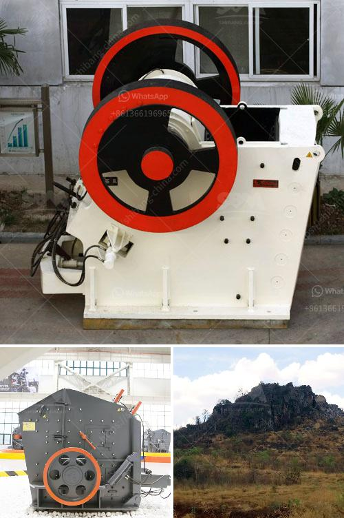

<h3>price of stone crusher plant</h3>
The increasing adoption of stone crushers in various sectors, such as mining, infrastructure and construction, highways and railways, will drive the stone crushing equipment market growth over the forecast timeline. The growth of the market is attributed to the advantages of the stone crushers including efficient operation of the stone crushing equipment, low operational cost, optimal cavity design, and high productivity.

Stone crusher plant investment is a must for construction sector, as well as self-employed individuals who want to start their own business. Many stone crusher plant manufacturers find that the application of stone crusher plant in industrial production can greatly improve production efficiency and product quality. Therefore, stone crusher plant has been rapid development, while also introducing stone crushing production line for large-scale materials.

Beneficiation process is a complex ore, thus need beneficiation equipment. Stone crusher is the main used mining equipment in South Africa mineral industry. Gold ore crushing plant machine will help to process the raw gold ore into high economic value products.

As a professional stone crusher plant manufacturer, SBM can provide various kinds of rock crushing machine with competitive price, including jaw crusher, impact crusher, cone crusher, and mobile crusher plant. SBM can also customize the crushing plants for our clients for more than 30 years.

Many stone crusher machines are used to crush stones in the mining industry. The price of stone crusher plant with the capacity of 100 tons per hour is equal to 10 million RMB. The price of main crusher machine in India varies widely depending on the quality, and the other different price is at different capacities.

Stone crusher plants used worldwide. It is available with different-2 capacity, design, and utility. Uses of Crusher plant. Stone crushing industry engaged in producing a crushed stone that used as a raw material for infrastructure projects like, road, highway, bridges, building canals, etc. All projects are considered as the core infrastructure work that gives the economy boom.

As the leading mining stone crusher manufacturer and exporter in China, we will provide maximum preferential factory price and discount for you. Our stone crusher has been exported to South Africa, Kenya, Nigeria, Ethiopia, Zambia, Namibia, Somalia, Nepal, Pakistan, Philippines, Malaysia, Saudi Arabic and over 90 countries around the world.

There are many types of stone crushers. Common types include jaw crushers, impact crushers, cone crushers, hammer crusher and vsi crusher. Each type has different models with different volumes and capacities. Therefore, different types of equipment have different costs, and the prices are naturally different.  Moreover, Of two crushing plants, it is better to choose one with better performance.

If you are interested in stone crusher plant, you can consult our online customer service for free to get more information about price, production capacity, aggregates output, granularity and so on. In order to help you find the most suitable stone crusher plant with the lowest cost, we can provide you with the complete stone crusher plant design, the pre-sale maintenance and after-sales service, and establish a good relationship with customers.
<h3>Contact us</h3><ul><li><strong>Whatsapp:&nbsp;<a href="https://wa.me/8613661969651">+8613661969651</a></strong></li><li><a href="https://swt.shibang-china.com/?git&amp;zhl&amp;price of stone crusher plant"><strong>Online Service(chat now)</strong></a></li></ul><h3>Related</h3><ul><li><a href='material using for making talcum powder.md'>material using for making talcum powder</a></li><li><a href='company of stone crusher.md'>company of stone crusher</a></li><li><a href='crushing machine manufacturers.md'>crushing machine manufacturers</a></li><li><a href='quarry business plan sample.md'>quarry business plan sample</a></li><li><a href='harga mesin pemecah batu kapasitas satu ton.md'>harga mesin pemecah batu kapasitas satu ton</a></li></ul>