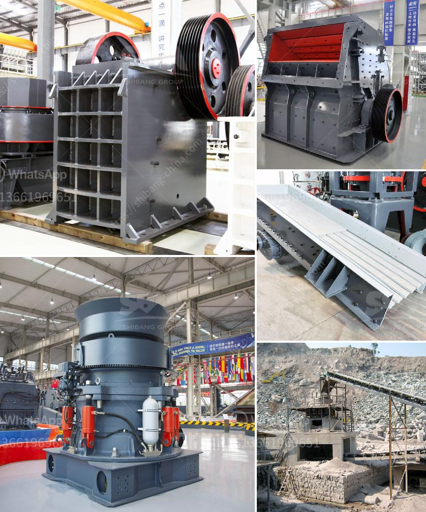

<h3>price of zenith cone crusher</h3>
The price of zenith cone crusher is based on the specific model you choose. When it comes to the model of cone crusher, there are three types, namely spring cone crusher, hydraulic cone crusher and compound cone crusher. These three types of cone crushers all have their own characteristics and advantages, so users can choose them according to their own needs.

Spring cone crusher, as the name suggests, adopts the principle of laminated crushing, which is suitable for crushing various ores and rocks with medium hardness. Compared with other types of cone crushers, spring cone crusher has the advantages of low maintenance cost and high crushing efficiency. The size of the final product can be adjusted by adjusting the discharge opening, which is very convenient for users.

Hydraulic cone crusher is upgraded on the basis of spring cone crusher. The biggest feature of hydraulic cone crusher is that it uses hydraulic clearance system to adjust the size of the discharge opening, which greatly simplifies the operation process. In addition, hydraulic cone crusher has high crushing ratio and high production efficiency. It is suitable for crushing medium-hard and above ores and rocks.

Compound cone crusher combines the advantages of spring cone crusher and hydraulic cone crusher. It has the characteristics of large crushing ratio, high efficiency, low energy consumption and uniform product size. Compound cone crusher is suitable for crushing various ores and rocks with medium and above hardness, such as limestone, iron ore, pebbles, non-ferrous metal ores, granite, basalt, limestone, granite, diabase and other hard materials.

The price of zenith cone crusher varies according to the model you choose. The smallest model of cone crusher is PYB600. It is suitable for crushing hard and medium-hard materials with compressive strength less than 320MPa. The price of PYB600 cone crusher is about 30,000-50,000 USD.

The cone crusher with medium model, such as PYZ900 and PYD900, is about 75,000-100,000 USD. The cone crusher with the largest model is HPC400, which can crush materials with compressive strength not exceeding 350MPa. The price of HPC400 cone crusher is about 400,000-600,000 USD.

In addition to the model, the price of zenith cone crusher is also affected by many other factors, such as manufacturers, equipment quality, after-sales service and market competition. Different manufacturers have different production costs, so the price of cone crusher from different manufacturers may vary. As for equipment quality, it directly affects the use effect and service life of cone crusher. Therefore, it is necessary to choose a reliable manufacturer.

In summary, the price of zenith cone crusher is determined by various factors, and users need to choose the appropriate model according to their own needs. At the same time, it is important to choose a reliable manufacturer to ensure the quality and after-sales service of the equipment. Only in this way can users get high-quality cone crusher at a reasonable price, and the investment can be more cost-effective.
<h3>Contact us</h3><ul><li><strong>Whatsapp:&nbsp;<a href="https://wa.me/8613661969651">+8613661969651</a></strong></li><li><a href="https://swt.shibang-china.com/?git&amp;zhl&amp;price of zenith cone crusher"><strong>Online Service(chat now)</strong></a></li></ul><h3>Related</h3><ul><li><a href='iron ore pelletisation plant china.md'>iron ore pelletisation plant china</a></li><li><a href='process of making talcum powder.md'>process of making talcum powder</a></li><li><a href='coal crushing and washing plant for sale in south africa.md'>coal crushing and washing plant for sale in south africa</a></li><li><a href='how much does it cost to rent a stone crusher.md'>how much does it cost to rent a stone crusher</a></li><li><a href='capital cost gold processing plant.md'>capital cost gold processing plant</a></li></ul>