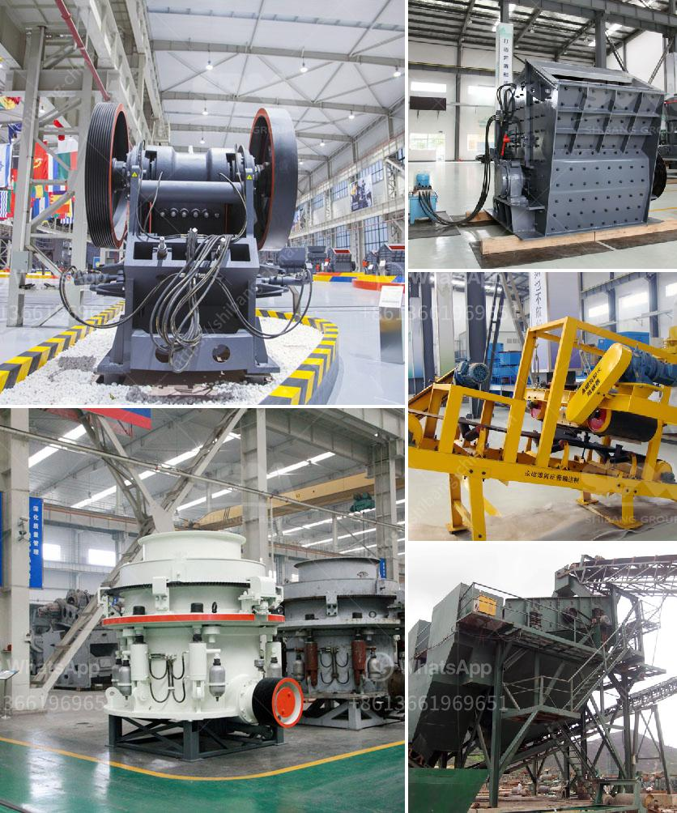

<h3>price stone crusher dragon</h3>
Stone crusher Dragon is one of the most popular and renowned names in the field of industrial machinery manufacturing. They are primarily known for their wide range of machines, which in their range include Stone crushers, dewatering systems, and other ancillary machinery. With almost two decades of industry experience, Dragon has carved a niche for itself by providing top-notch quality products at competitive prices.

The price of a stone crusher Dragon varies depending on several factors. The most important factor influencing the price is the machine's capacity. A stone crusher Dragon with a higher capacity will naturally cost more compared to a machine with a lower capacity. This is because a high-capacity stone crusher requires more robust construction and higher-quality components, thereby increasing its overall cost.

Another factor that affects the price of a stone crusher Dragon is the type of machine. Dragon offers a wide range of stone crushers, each designed for specific applications. For instance, they have crushers for primary crushing, secondary crushing, and tertiary crushing. The type of crusher required will depend on the job site conditions, the size and hardness of the raw material, and the desired final product. As the complexity of the machine increases, so does its price.

Apart from capacity and machine type, the price of a stone crusher Dragon also depends on its features and specifications. Dragon offers various optional features such as hydraulic adjustment, automatic lubrication system, and remote control operation. These features enhance the performance and convenience of the machine but add to its overall cost.

Furthermore, the price of a stone crusher Dragon is also influenced by market demand and competition. In a highly competitive market, manufacturers strive to offer the best value for money, which often translates into competitive pricing. Dragon aims to strike a balance between affordability and quality, ensuring that their customers get the best possible product at a reasonable price.

One key advantage of purchasing a stone crusher Dragon is the excellent after-sales service provided by the company. Dragon understands that timely and efficient after-sales support is crucial for maintaining customer satisfaction. They have a dedicated team of service technicians who are available to address any issues or queries faced by the customers. This commitment to customer service has helped build a loyal customer base for Dragon over the years.

To conclude, the price of a stone crusher Dragon can vary depending on capacity, machine type, features, and market demand. However, regardless of the price, Dragon is synonymous with quality and reliability. Their machines are built to last and offer exceptional performance, making them a wise investment for any industrial operation. With their commitment to customer service, Dragon ensures that their customers receive proper assistance even after the purchase. If you are looking for a reliable stone crusher, Dragon should be at the top of your list.
<h3>Contact us</h3><ul><li><strong>Whatsapp:&nbsp;<a href="https://wa.me/8613661969651">+8613661969651</a></strong></li><li><a href="https://swt.shibang-china.com/?git&amp;zhl&amp;price stone crusher dragon"><strong>Online Service(chat now)</strong></a></li></ul><h3>Related</h3><ul><li><a href='services of a crushing machine.md'>services of a crushing machine</a></li><li><a href='list of mini cement plants in gujarat.md'>list of mini cement plants in gujarat</a></li><li><a href='stamp mills for sale in zimbabwe.md'>stamp mills for sale in zimbabwe</a></li><li><a href='how to start a stone crushing business in nigeria.md'>how to start a stone crushing business in nigeria</a></li><li><a href='used ball mills for sale.md'>used ball mills for sale</a></li></ul>