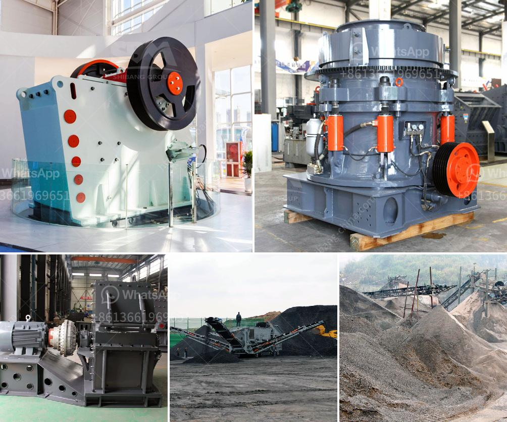

<h3>prices of aggregate crusher plants</h3>
Aggregate crusher plants are essential equipment in mining, construction, and road building projects. These plants are used to break down large-sized rocks into smaller, more manageable sizes for various applications. The availability of aggregate crusher plants in the market is crucial for any construction project as it ensures a constant supply of materials.

One of the primary factors that influence the prices of aggregate crusher plants is the type of crusher being used. Different crushers have different capabilities and specifications, which directly affect their pricing. For example, jaw crushers are known for their higher capacity and efficiency, making them a popular choice for large-scale projects. Cone crushers, on the other hand, are smaller in size but often produce finer materials and are more suitable for secondary or tertiary crushing.

Another significant factor impacting the prices of aggregate crusher plants is their production capacity. Plants with higher production capacities generally command higher prices due to their ability to process larger quantities of materials. However, it is essential to consider the requirements of the specific project. Investing in a plant with excessive capacity may not be cost-effective for smaller projects, while opting for a smaller capacity plant may lead to production delays for more extensive projects.

The quality of the aggregate crusher plant also plays a vital role in determining its price. Plants manufactured by reputable and well-known brands are generally priced higher due to their proven reliability, durability, and performance. These plants often come with advanced features and technologies that improve efficiency and reduce maintenance costs over the long term. While investing in a high-quality plant may have a higher upfront cost, it can result in significant savings and improved productivity in the long run.

Geographical location can also impact the prices of aggregate crusher plants due to transportation costs. Plants located closer to the source of raw materials naturally incur lower transportation costs, making them more affordable. Conversely, plants situated in remote areas may have higher prices due to the additional costs associated with transporting materials to and from the site.

Finally, market demand and competition can affect the prices of aggregate crusher plants. If the demand for these plants is high and the number of suppliers is limited, prices may be driven up. Conversely, if the market is saturated with multiple suppliers, prices may be more competitive.

In conclusion, the prices of aggregate crusher plants are influenced by various factors such as the type of crusher, production capacity, quality, geographical location, and market demand. It is crucial for buyers to carefully consider these factors and their specific project requirements to make informed decisions. While it is essential to find a plant that fits within budget constraints, focusing solely on the lowest price may not always result in the most cost-effective solution. By balancing factors such as quality, performance, and long-term benefits, buyers can ensure that they invest in the most suitable aggregate crusher plant for their needs.
<h3>Contact us</h3><ul><li><strong>Whatsapp:&nbsp;<a href="https://wa.me/8613661969651">+8613661969651</a></strong></li><li><a href="https://swt.shibang-china.com/?git&amp;zhl&amp;prices of aggregate crusher plants"><strong>Online Service(chat now)</strong></a></li></ul><h3>Related</h3><ul><li><a href='copper ore processing plant kenya.md'>copper ore processing plant kenya</a></li><li><a href='nigeria quartz plant in kenya.md'>nigeria quartz plant in kenya</a></li><li><a href='ball mill for sand and gravel.md'>ball mill for sand and gravel</a></li><li><a href='stone crushers price in south.md'>stone crushers price in south</a></li><li><a href='how much can a quarry plant cost.md'>how much can a quarry plant cost</a></li></ul>