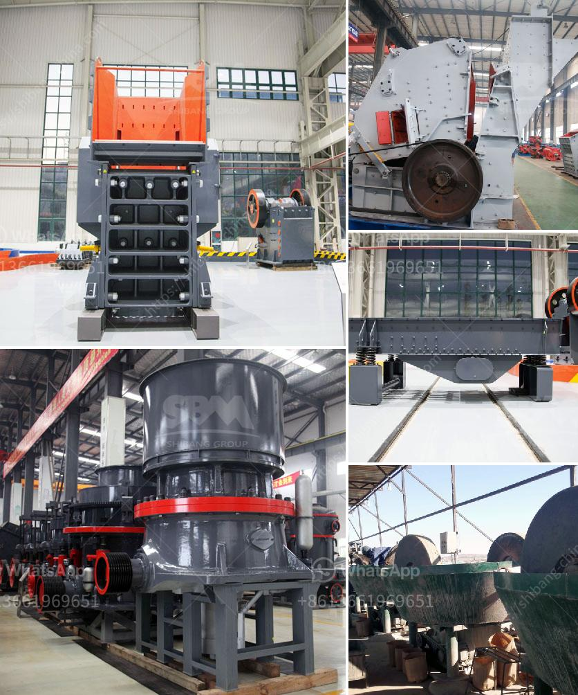

<h3>prices of coal pulverizers</h3>
Coal pulverizers are essential equipment in the coal-fired power generation industry. These machines are responsible for grinding coal into fine powder, which is then used as a fuel in power plants. As such, the prices of coal pulverizers can vary significantly depending on various factors.

One of the primary factors that determine the price of coal pulverizers is their size and capacity. Pulverizers are designed to handle a specific amount of coal per hour, and machines with larger capacities tend to cost more. Typically, coal pulverizers are available in different sizes, ranging from small units that can process a few tons of coal per hour to larger machines capable of handling hundreds of tons.

The quality and durability of the materials used in the construction of coal pulverizers also impact their prices. Machines made from high-quality materials such as hardened steel or alloy steel tend to be more expensive than those made from regular steel. This is because robust materials can withstand the harsh conditions and stresses placed on pulverizers during operation, leading to longer lifespans and reduced maintenance costs.

Furthermore, the level of automation and advanced features incorporated in coal pulverizers can significantly affect their prices. Modern pulverizers often include automated controls, real-time monitoring systems, and advanced safety features. While these technological advancements enhance the operational efficiency and safety of the machines, they also contribute to higher prices due to the research, development, and additional components required for their implementation.

Moreover, factors like availability, market demand, and competition among manufacturers can influence coal pulverizer prices. If there is a shortage of suppliers or high demand for these machines, prices are likely to rise. On the other hand, increased competition can drive prices down as manufacturers seek to offer competitive pricing to win customers.

In conclusion, the prices of coal pulverizers vary depending on factors such as size, capacity, materials used, level of automation, and market dynamics. Potential buyers should consider their specific requirements and budget constraints when selecting a coal pulverizer, ensuring they find the best balance between price and performance for their needs.
<h3>Contact us</h3><ul><li><strong>Whatsapp:&nbsp;<a href="https://wa.me/8613661969651">+8613661969651</a></strong></li><li><a href="https://swt.shibang-china.com/?git&amp;zhl&amp;prices of coal pulverizers"><strong>Online Service(chat now)</strong></a></li></ul><h3>Related</h3><ul><li><a href='nigeria crusher suppliers.md'>nigeria crusher suppliers</a></li><li><a href='gravel and sand mining equipment.md'>gravel and sand mining equipment</a></li><li><a href='nigeria quartz plant in kenya.md'>nigeria quartz plant in kenya</a></li><li><a href='bentonite crushers manufacturers.md'>bentonite crushers manufacturers</a></li><li><a href='the company mines limestone in ethiopia.md'>the company mines limestone in ethiopia</a></li></ul>