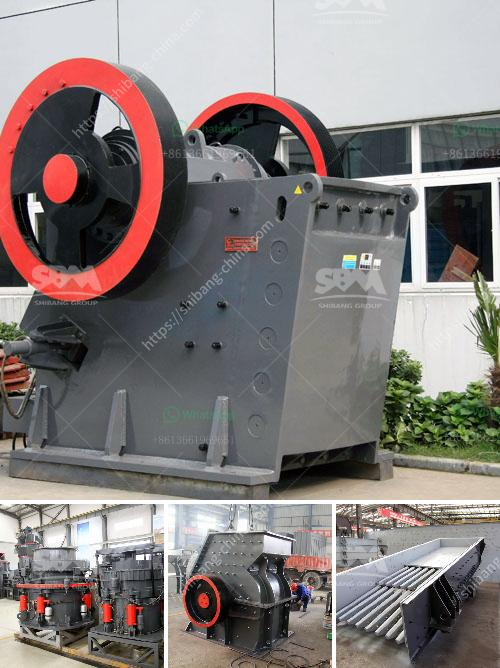

<h3>prices of complete crushing plant</h3>
The world of construction and mining requires sturdy equipment that can endure the rigors of heavy-duty operations. That's where a complete crushing plant comes in. A complete crushing plant comprises several different components, including a stable working platform, high-quality and strong crushing equipment, conveyors and other types of handling equipment, and dust suppression devices. Each of these components works together to enable the efficient and effective crushing of the material, resulting in the production of high-quality aggregates.

When it comes to the prices of complete crushing plants, several factors come into play. These factors include the brand, capacity, size, efficiency, and functionality of the plant. Additionally, the prices can vary depending on the market demand and location. In this article, we will delve into the different price ranges you can expect for a complete crushing plant and the factors that contribute to these prices.

The most crucial factor that determines the price of a complete crushing plant is its capacity. Crushing plants are available in various sizes and capacities, ranging from a few tons per hour to several thousand tons per hour. The greater the capacity, the higher the price tag. A crushing plant with a higher capacity is generally more expensive due to the additional materials, engineering, and labor required to construct and operate it.

Another significant factor that affects prices is the brand of the crushing plant. Well-established and reputable brands often command higher prices as they have earned a reputation for producing high-quality and reliable equipment. Although established brands may have higher initial costs, they can be cost-effective investments in the long run due to their durability and longevity.

Efficiency and functionality also impact the price of a complete crushing plant. More efficient plants will often come at a higher price due to their ability to produce more output with the same amount of input. Crushing plants with advanced features, such as remote control operation and automatic monitoring systems, may also be pricier but can lead to increased productivity and reduced downtime.

Lastly, the geographic location of the plant's market also plays a role in pricing. Different regions may have varying demand and supply dynamics, leading to fluctuations in prices. Additionally, transportation costs can impact the final price of the plant, especially if it needs to be shipped or transported over long distances.

In conclusion, the prices of complete crushing plants can range widely based on several factors. The capacity, brand, efficiency, functionality, and geographic location all come into play, each contributing to the final price. It is essential to carefully consider these factors and conduct thorough research when selecting a complete crushing plant to ensure the best investment for your specific needs.
<h3>Contact us</h3><ul><li><strong>Whatsapp:&nbsp;<a href="https://wa.me/8613661969651">+8613661969651</a></strong></li><li><a href="https://swt.shibang-china.com/?git&amp;zhl&amp;prices of complete crushing plant"><strong>Online Service(chat now)</strong></a></li></ul><h3>Related</h3><ul><li><a href='crusher plant in rajasthan.md'>crusher plant in rajasthan</a></li><li><a href='potassium ore production equipment.md'>potassium ore production equipment</a></li><li><a href='limestone mobile crushing plant.md'>limestone mobile crushing plant</a></li><li><a href='slag crusher makers in india.md'>slag crusher makers in india</a></li><li><a href='how to make clay powder machine.md'>how to make clay powder machine</a></li></ul>