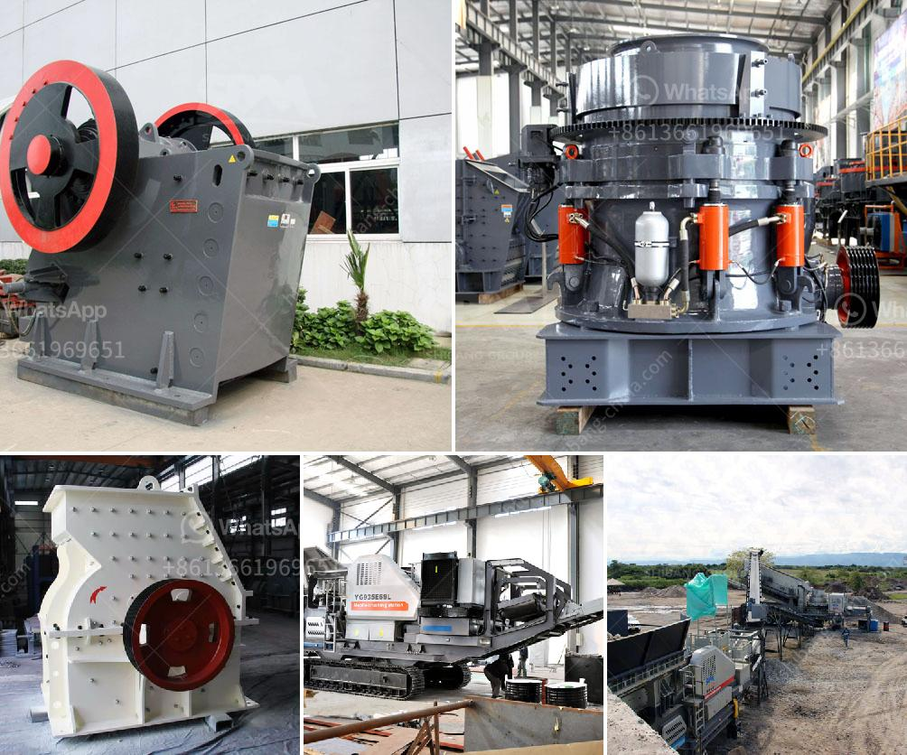

<h3>prices of industrial conveyor belts</h3>
Industrial conveyor belts play a crucial role in enhancing production efficiency and streamlining processes across various industries. From assembly lines to material handling, these belts are designed to transport goods and materials effortlessly. However, before investing in a conveyor belt, it's important to understand the factors that dictate their prices and make an informed decision. In this article, we will explore and shed light on the pricing range of industrial conveyor belts.

One of the primary factors influencing conveyor belt prices is the material used for its construction. Common materials include rubber, PVC, nylon, and steel. Each material has different properties, durability levels, and resistance to wear and tear, which affect the overall cost.

As expected, longer and wider conveyor belts generally come with higher price tags. The length and width of the belt are determined by the specific application and the volume of goods it needs to handle. Customization, in terms of length and width, further adds to the overall cost.

The specific requirements of the application also impact the pricing of conveyor belts. Factors such as load capacity, speed, incline or decline angles, and automation capabilities affect the overall design complexity and, consequently, the cost of the belt.

Industrial conveyor belts can range in price depending on the aforementioned factors. On average, a standard belt may cost anywhere between $500 to $1,500 per meter. However, for more complex applications, with advanced features or specialized materials, the price can exceed $5,000 per meter. It's important to note that these figures are approximate and can vary based on individual manufacturer specifications, customization needs, and market conditions.

Investing in an industrial conveyor belt requires careful consideration of various factors, including the desired material, construction, length, width, and operational requirements. These factors directly impact the pricing of conveyor belts, making it essential for businesses to evaluate their specific needs and budgetary constraints. By collaborating with reputable suppliers, businesses can find the optimal conveyor belt solution that strikes a balance between quality, efficiency, and affordability.
<h3>Contact us</h3><ul><li><strong>Whatsapp:&nbsp;<a href="https://wa.me/8613661969651">+8613661969651</a></strong></li><li><a href="https://swt.shibang-china.com/?git&amp;zhl&amp;prices of industrial conveyor belts"><strong>Online Service(chat now)</strong></a></li></ul><h3>Related</h3><ul><li><a href='mobile recycle crushing.md'>mobile recycle crushing</a></li><li><a href='used in vibrating screens.md'>used in vibrating screens</a></li><li><a href='rock crushers manufacturers.md'>rock crushers manufacturers</a></li><li><a href='sand making machine from china.md'>sand making machine from china</a></li><li><a href='graphite powder making machine.md'>graphite powder making machine</a></li></ul>