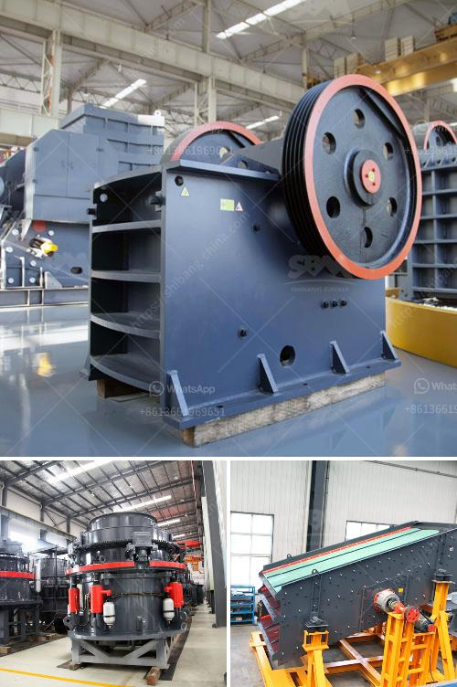

<h3>prices on cone crusher parts</h3>
Cone crushers are heavy-duty machinery commonly used in the mining and aggregate industries to crush various types of raw materials. They have a high rotation speed and a large feed opening, making them highly efficient at crushing large rocks and ores into smaller pieces. However, like any other machinery, cone crushers require regular maintenance and occasional replacement of parts to ensure their optimal performance.

One of the critical components of a cone crusher is its wearing parts. These parts include the mantle, concave, bowl liner, and other wear-resistant parts that come in direct contact with the raw materials being crushed. Over time, these parts wear out due to the high-stress environment in which they operate, and they need to be replaced to maintain the crusher's efficiency.

When it comes to the prices of cone crusher parts, several factors come into play. The first and foremost is the quality of the parts. High-quality parts tend to be more expensive but offer better durability and longer service life. Investing in quality parts can result in cost savings in the long run, as they reduce overall maintenance and replacement expenses.

The second factor that affects the prices is the brand and reputation of the manufacturer. Well-known manufacturers with a history of producing reliable and durable parts tend to charge higher prices. However, these manufacturers often have stricter quality control processes, ensuring the parts' performance and reducing the risk of failure.

Lastly, the complexity and design of cone crusher parts also influence their prices. Parts with intricate designs or made from rare and expensive materials will naturally cost more than standardized components. Additionally, the availability of spare parts in the market can impact their prices. Parts from popular cone crusher models tend to be more readily available, leading to competitive pricing.

In conclusion, cone crusher parts' prices can vary significantly depending on factors such as quality, manufacturer reputation, design complexity, and availability. It is essential to consider these factors when purchasing replacement parts to ensure the best value for money and optimal performance of the cone crusher. Investing in high-quality parts may result in higher upfront costs but can save money in the long run by reducing overall maintenance and replacement expenses.
<h3>Contact us</h3><ul><li><strong>Whatsapp:&nbsp;<a href="https://wa.me/8613661969651">+8613661969651</a></strong></li><li><a href="https://swt.shibang-china.com/?git&amp;zhl&amp;prices on cone crusher parts"><strong>Online Service(chat now)</strong></a></li></ul><h3>Related</h3><ul><li><a href='harga grinder mill.md'>harga grinder mill</a></li><li><a href='hammer mills for sand.md'>hammer mills for sand</a></li><li><a href='silica sand washing plant.md'>silica sand washing plant</a></li><li><a href='jaw crusher specification.md'>jaw crusher specification</a></li><li><a href='project cost of stone crusher of 100 tph.md'>project cost of stone crusher of 100 tph</a></li></ul>