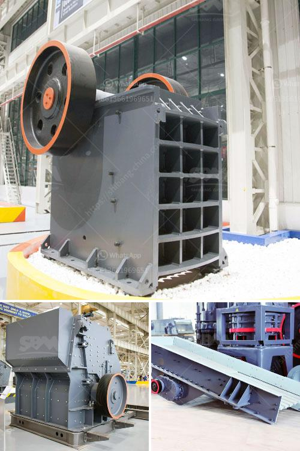

<h3>primary impact crusher</h3>
A primary impact crusher is a machine that is used for crushing materials of all hardness levels. It is a versatile crushing equipment that suits almost any type of material, including highly abrasive and low abrasive materials. Primary impact crushers are used to process materials such as limestone, granite, coal, and concrete to produce a wide range of end products.

One of the key advantages of a primary impact crusher is its ability to handle big feed sizes. The crusher has a large feed opening, allowing it to handle oversized materials. This ensures higher production rates and more efficient crushing process. The primary impact crusher can also be adjusted to accommodate different feed sizes, ensuring a controlled and consistent product size.

Another notable feature of a primary impact crusher is its high reduction ratio. This means that the crusher can effectively reduce the size of the material to the desired size. A higher reduction ratio means more efficient crushing and fewer stages required in the crushing process. It also means that less energy is required to crush the material, resulting in lower operational costs.

Primary impact crushers are designed for easy maintenance and servicing. They are equipped with hydraulic cylinders that enable the quick and easy opening of the crusher's housing for inspection and maintenance. The crusher's blow bars can also be easily replaced when worn out, ensuring minimal downtime and maximum productivity.

Additionally, primary impact crushers are equipped with a rotor and hammer system that provides high crushing efficiency. The rotor is driven by a motor, which rotates the hammers and impacts the material in the crushing chamber. This impact force breaks the material into smaller pieces, which are then discharged through the crusher's adjustable outlet.

With the increasing demand for sustainable and environmentally friendly solutions, primary impact crushers are designed to have low environmental impact. They are equipped with an effective dust suppression system that minimizes the emission of dust particles during the crushing process. This ensures a healthier work environment and less pollution.

Primary impact crushers are available in various designs and configurations to suit different applications. They can be stationary or mobile, depending on the site requirements. Mobile primary impact crushers are particularly useful for construction sites and road projects, as they can be easily transported to different locations.

In conclusion, a primary impact crusher is a versatile and efficient crushing solution that can handle a wide range of materials. Its large feed opening, high reduction ratio, and easy maintenance make it a popular choice for various applications. With its low environmental impact and customizable designs, it is an ideal crushing machine for achieving high-quality end products.
<h3>Contact us</h3><ul><li><strong>Whatsapp:&nbsp;<a href="https://wa.me/8613661969651">+8613661969651</a></strong></li><li><a href="https://swt.shibang-china.com/?git&amp;zhl&amp;primary impact crusher"><strong>Online Service(chat now)</strong></a></li></ul><h3>Related</h3><ul><li><a href='recycling machines for sale in south africa.md'>recycling machines for sale in south africa</a></li><li><a href='price of copper smelting plant.md'>price of copper smelting plant</a></li><li><a href='gravel crusher prices philippines.md'>gravel crusher prices philippines</a></li><li><a href='crushing machine company.md'>crushing machine company</a></li><li><a href='coal grinding machinery manufacture in india.md'>coal grinding machinery manufacture in india</a></li></ul>