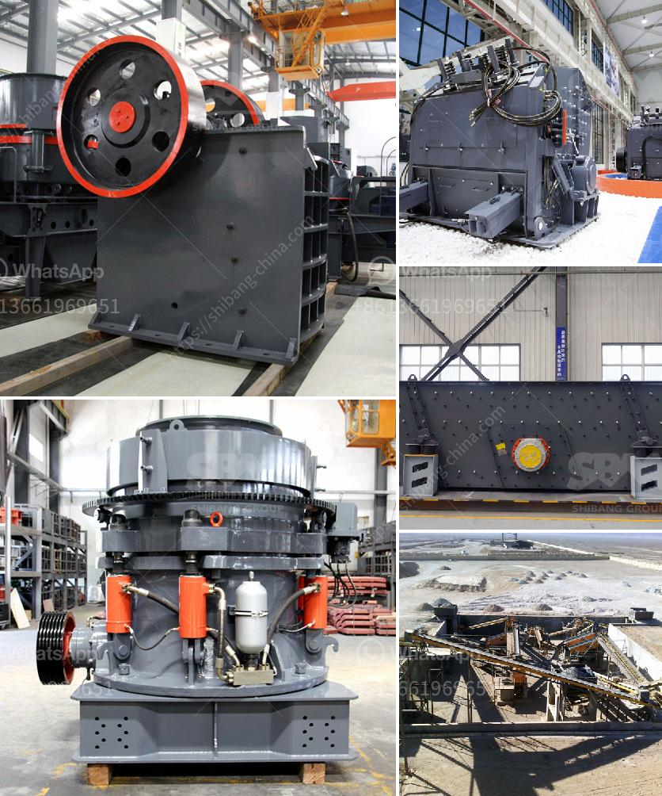

<h3>primary stone crusher</h3>
Primary stone crusher, also known as stone jaw crusher, can crush various materials, such as granite, limestone, basalt, pebbles, river pebble, iron ore, etc. Its feed size is usually up to 500mm and the finished product size is usually 10-50mm. It is widely used in metallurgy, chemical industry, building materials, electric power, water conservancy, transportation, and other fields.

With the continuous improvement of crushing technology and the advancement of engineering, stone crusher equipment has made great progress in terms of design and performance. In recent years, the structure of the primary crusher has been continuously optimized, making it more reliable in operation and convenient to maintain.

The working principle of the primary stone crusher is simple, and it is driven by an electric motor. When the motor runs, the belt and pulley are driven, making the movable jaw move back and forth, and the material is crushed in the crushing chamber. The crushed material is discharged from the discharge port at the lower part of the machine.

The primary stone crusher has a large crushing ratio, uniform product size, simple structure, convenient maintenance, and low operation cost. It is widely used in mining, metallurgy, building materials, highway, railway, water conservancy, and chemical industries.

With the continuous development of the construction industry and the increasing demand for stones, the market for primary stone crushers is booming. Many manufacturers have launched various models of stone crushers to meet the needs of different customers. When choosing a primary stone crusher, customers should consider their own production needs, output requirements, material properties, and other factors to select the most suitable equipment.

In summary, the primary stone crusher plays a vital role in the crushing process. It has a wide range of applications in various industries and is favored by more and more customers. With its reliable performance and high efficiency, it will continue to make a significant contribution to the development of the construction industry.
<h3>Contact us</h3><ul><li><strong>Whatsapp:&nbsp;<a href="https://wa.me/8613661969651">+8613661969651</a></strong></li><li><a href="https://swt.shibang-china.com/?git&amp;zhl&amp;primary stone crusher"><strong>Online Service(chat now)</strong></a></li></ul><h3>Related</h3><ul><li><a href='sell of used dolomite roller mill in india.md'>sell of used dolomite roller mill in india</a></li><li><a href='grinding machine for white clay in india.md'>grinding machine for white clay in india</a></li><li><a href='cone crusher hp 300.md'>cone crusher hp 300</a></li><li><a href='roller mill nigeria.md'>roller mill nigeria</a></li><li><a href='gypsum processing machines.md'>gypsum processing machines</a></li></ul>