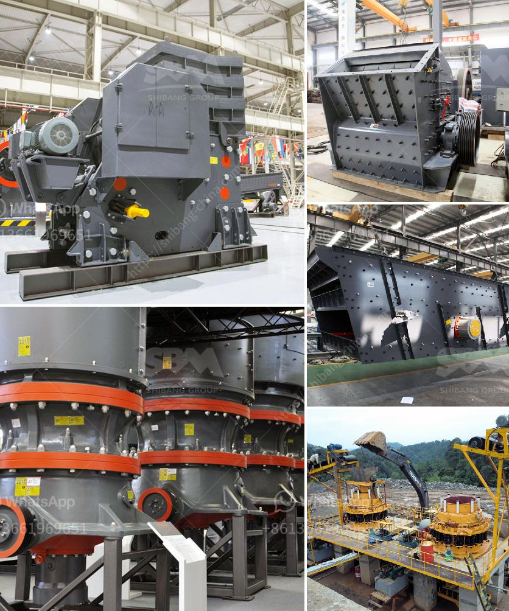

<h3>principle of cone crusher</h3>
The cone crusher is one of the most common types of crushing equipment for crushing medium-hard and above materials in the mining industry. With the advancement of technology, the cone crusher has undergone continuous upgrades since its inception, enabling it to process higher hardness materials with higher efficiency and lower operating costs.

The principle of the cone crusher is straightforward. Once the material is crushed, it can be sieved to the desired particle size through the cavity clearance of the cone crusher. The cone crusher crushes the material by squeezing the material between an eccentrically rotating spindle and a concave hopper. As the spindle rotates, the material is crushed by the continuously moving concave, and the crushed material is discharged through the bottom of the crusher.

The working principle of the cone crusher is continuous, and the crusher will provide a high rotational speed and a steep crushing chamber, resulting in efficient crushing. The crushing process consists of two consecutive steps, which are controlled by the crusher's chamber selection and the material's particle size.

During the operation of the cone crusher, the mantle moves around the axis of the crushing chamber in a circular motion, creating compression crushing between the mantle and the concave. The concave is fixed and immovable, while the mantle moves in a cyclical motion.

One of the key factors in achieving the desired final product shape and size is the adjustability of the crusher's closed side setting (CSS). The CSS is the smallest distance between the concave and the mantle. By adjusting the CSS, the crusher can effectively control the product size and shape.

Another important aspect is the material feed size. The larger the feed size, the more work the cone crusher needs to do to achieve the required crushing results. If the feed material is too large, the cone crusher may not be able to handle it, causing excessive wear and possible damage to the crusher.

To optimize the crushing process, it is recommended to always use a choke-fed crusher, which means that the cavity should be as full of rock material as possible. This is important for achieving a consistent product gradation and a high reduction ratio.

In addition to these operational principles, cone crushers also use compressive force to break particles based on the mechanical properties of the rock material. The crushing process is achieved by the eccentric rotation of the main shaft, which drives the mantle and the concave to squeeze and break the rocks.

In conclusion, the cone crusher is a versatile and important piece of equipment in the mining industry, and its overall efficiency and effectiveness can be maximized by adhering to the principles discussed above. Additionally, regular maintenance and inspection will ensure the cone crusher operates smoothly and efficiently to meet the demands of the crushing application.
<h3>Contact us</h3><ul><li><strong>Whatsapp:&nbsp;<a href="https://wa.me/8613661969651">+8613661969651</a></strong></li><li><a href="https://swt.shibang-china.com/?git&amp;zhl&amp;principle of cone crusher"><strong>Online Service(chat now)</strong></a></li></ul><h3>Related</h3><ul><li><a href='potential of mica wet grinding plant.md'>potential of mica wet grinding plant</a></li><li><a href='china clay washing equipment sale supplier.md'>china clay washing equipment sale supplier</a></li><li><a href='cost of 1000 tpd cement plant.md'>cost of 1000 tpd cement plant</a></li><li><a href='silica water washing plant manufacturers in india.md'>silica water washing plant manufacturers in india</a></li><li><a href='screening and wash plant manufacturers in south africa.md'>screening and wash plant manufacturers in south africa</a></li></ul>