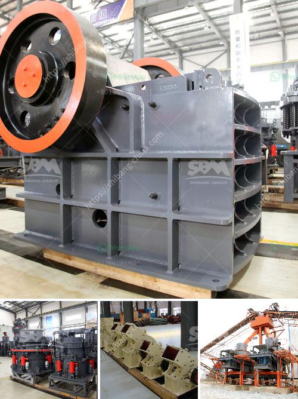

<h3>process of cement</h3>
Cement is a crucial building material that plays a significant role in the construction industry. It is a composite material made from a mixture of limestone, clay, and other ingredients. The production of cement involves a complex process that begins with the extraction of raw materials and ends with the final product.

The first step in the process is the extraction of raw materials. Limestone, clay, and other suitable materials are excavated from quarries or mines. These raw materials are then transported to the cement plant, where they are crushed and stored in separate compartments.

After the raw materials are crushed, they are proportionally mixed to achieve the desired chemical composition. The precise mixture of limestone, clay, and other additives is essential to ensure the quality and strength of the final product. This mixture is known as raw meal and resembles a coarse powder.

The next step in the process is the preheating and pre-calcination of the raw meal. The raw meal is fed into a preheater, which is a series of cyclones or chambers designed to heat the raw meal and remove any moisture. As the raw meal travels through the preheater, it is also subjected to a process known as pre-calcination, where the raw materials are partially calcined to form clinker.

Clinker is the intermediate product obtained from the preheating and pre-calcination process. It is a dark, gray, nodular material with a granular structure. The clinker is then transferred to a cooler, where it is rapidly cooled to avoid the reformation of minerals. This cooling process is essential to maintain the quality and stability of the clinker.

Once the clinker is cooled, it is ground into a fine powder known as cement. This grinding process is usually carried out in a ball mill, a horizontal cylindrical container filled with steel balls. The clinker is further pulverized and mixed with gypsum to regulate the setting time of the cement.

After the grinding process, the cement is stored in silos until it is ready for packaging or transportation. Before being used, the cement goes through a process known as hydration, where it reacts with water to form a solid mass. This hydration process is responsible for the hardening and setting of the cement, making it capable of binding together other building materials.

In conclusion, the production of cement is a complex process that involves the extraction of raw materials, their proportionate mixing, preheating and pre-calcination, grinding, and finally, hydration. Each step in the process is crucial to ensure the quality and strength of the final product. Cement is an essential component in the construction industry and continues to be a vital material for building structures.
<h3>Contact us</h3><ul><li><strong>Whatsapp:&nbsp;<a href="https://wa.me/8613661969651">+8613661969651</a></strong></li><li><a href="https://swt.shibang-china.com/?git&amp;zhl&amp;process of cement"><strong>Online Service(chat now)</strong></a></li></ul><h3>Related</h3><ul><li><a href='belt conveyor design free.md'>belt conveyor design free</a></li><li><a href='talc powder mill suppliers in china.md'>talc powder mill suppliers in china</a></li><li><a href='jual stone crusher merk.md'>jual stone crusher merk</a></li><li><a href='new ready mix crusher setup plan.md'>new ready mix crusher setup plan</a></li><li><a href='gold crusher philippines.md'>gold crusher philippines</a></li></ul>