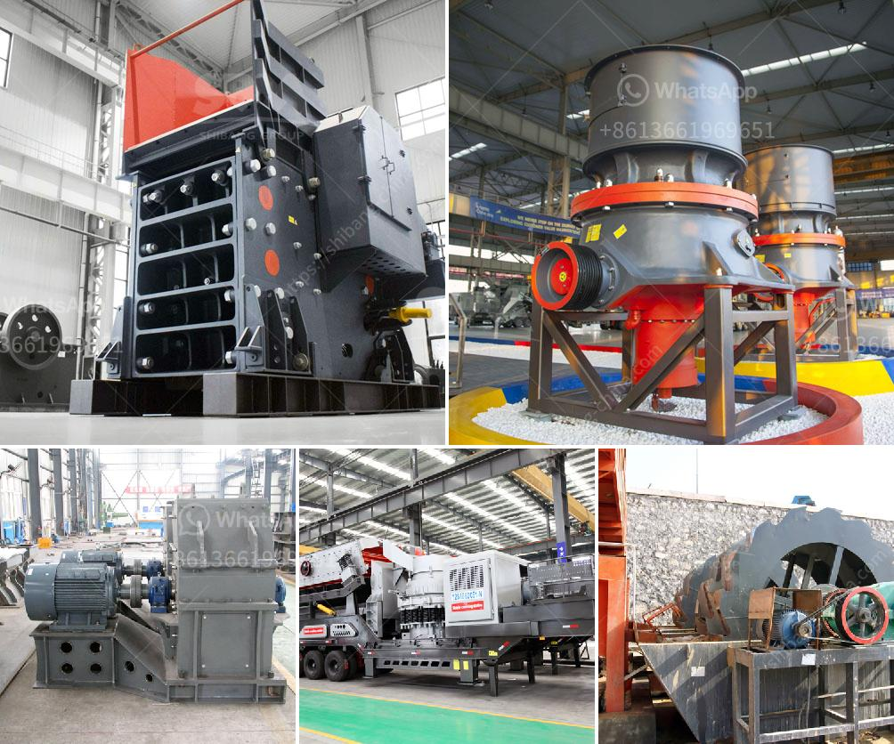

<h3>process of limestone crusher</h3>
Limestone is widely used in industries such as construction, metallurgy, chemical engineering, power plant, etc. It is indispensable in modern building materials and industrial production. With the continuous improvement of technology, limestone crusher has evolved into an indispensable equipment in the limestone processing industry. Here, I will introduce the limestone crushing process and equipment.

The limestone crushing process generally includes several stages: coarse crushing, medium crushing, and fine crushing. Firstly, the raw limestone is crushed into a size suitable for grinding by jaw crusher. Then, the crushed limestone is evenly fed into the impact crusher through the vibrating feeder for secondary crushing. After being crushed, the limestone particles are screened with the vibrating screen and the qualified particles are transported to the finished product area through the belt conveyor. The unqualified particles are returned to the impact crusher for further crushing.

In the fine crushing stage, the limestone is further crushed into the required size by the sand making machine. Finally, the limestone particles are classified by the vibrating screen and the required size limestone particles are sent to the sand washing machine for cleaning.

In the limestone crushing process, jaw crusher and impact crusher are commonly used as primary crushers, which are characterized by simple structure, large crushing ratio, and high production efficiency. In order to meet different requirements of customers, it is necessary to select the appropriate equipment.

In conclusion, the limestone crusher in the limestone crushing process is an important equipment to consider when processing limestone. With the continuous growth of limestone industry, the demand for limestone crusher is also increasing. Let us continue to explore the limestone crushing process together and contribute to the development of the limestone industry.
<h3>Contact us</h3><ul><li><strong>Whatsapp:&nbsp;<a href="https://wa.me/8613661969651">+8613661969651</a></strong></li><li><a href="https://swt.shibang-china.com/?git&amp;zhl&amp;process of limestone crusher"><strong>Online Service(chat now)</strong></a></li></ul><h3>Related</h3><ul><li><a href='process of limestone crusher.md'>process of limestone crusher</a></li><li><a href='washing process of chromite ore beneficiation.md'>washing process of chromite ore beneficiation</a></li><li><a href='conveyor belt manufacturers in pakistan.md'>conveyor belt manufacturers in pakistan</a></li><li><a href='double toggle jaw crushers.md'>double toggle jaw crushers</a></li><li><a href='mobile coal jaw crusher for hire.md'>mobile coal jaw crusher for hire</a></li></ul>