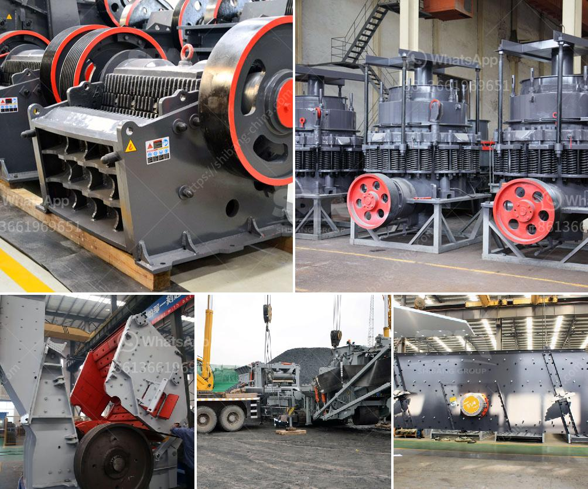

<h3>process of making talcum powder</h3>
The process of making talcum powder is rather simple and can be accomplished by following a set of steps. Talcum powder is made from a mineral called talc, which is comprised mainly of magnesium, silicon, and oxygen. Talc is mined from the earth's crust, where it is often found in metamorphic rocks.

The first step in the process of making talcum powder is the rock extraction. Talc rocks are mined from the earth's crust using various techniques such as open-pit mining. The extracted talc rocks are then transported to the crushing plant to be broken down into smaller pieces.

Once the talc rocks have been broken down, they are usually washed to remove any impurities. This ensures that the final product is of high quality and purity. The washed talc rocks are then dried in large kilns or dryers to reduce the moisture content.

After the drying process, the talc rocks are crushed into a fine powder. This is typically done using crushers or mills specifically designed for talc grinding. The resulting powder is then further refined to achieve the desired particle size and consistency.

To enhance the properties of the talcum powder, additional ingredients are sometimes added. These can include fragrances, colorants, and other additives to improve the powder's scent, appearance, and texture. These additional ingredients are thoroughly mixed with the talc powder to ensure an even distribution.

The final step in the process of making talcum powder is packaging. The powdered talc is carefully packaged into containers such as bottles, jars, or cans. The containers are labeled and sealed to prevent any contamination or moisture absorption.

It is important to note that the process of making talcum powder should adhere to strict quality control measures to ensure the safety of the final product. This includes testing for impurities, microbiological contamination, and compliance with regulatory standards.

Talcum powder has been used for various purposes for centuries. It is commonly used as a body powder to provide a smooth and silky feel on the skin. Additionally, talcum powder is used in cosmetics, baby products, and even in some food processing to prevent caking and improve texture.

In recent years, the safety of talcum powder has raised concerns due to a potential link between talc and certain types of cancer. It is important for manufacturers to use high-quality talc and ensure proper testing and quality control to minimize any potential risks.

In conclusion, the process of making talcum powder involves mining, crushing, drying, grinding, refining, and packaging. It is a relatively straightforward process with the addition of optional ingredients to enhance the product's properties. However, strict quality control measures should be followed to ensure the safety and purity of the final product.
<h3>Contact us</h3><ul><li><strong>Whatsapp:&nbsp;<a href="https://wa.me/8613661969651">+8613661969651</a></strong></li><li><a href="https://swt.shibang-china.com/?git&amp;zhl&amp;process of making talcum powder"><strong>Online Service(chat now)</strong></a></li></ul><h3>Related</h3><ul><li><a href='puzzolana tph cone crusher plant prices.md'>puzzolana tph cone crusher plant prices</a></li><li><a href='sand core making machine.md'>sand core making machine</a></li><li><a href='cement clinker powder line.md'>cement clinker powder line</a></li><li><a href='iron ore beneficiation poland.md'>iron ore beneficiation poland</a></li><li><a href='prices of industrial conveyor belts.md'>prices of industrial conveyor belts</a></li></ul>