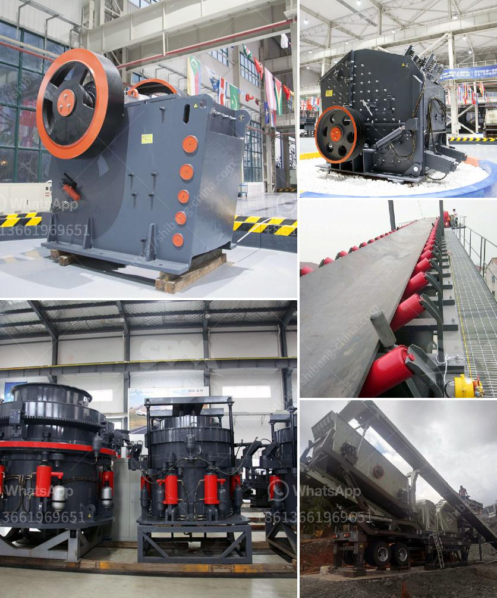

<h3>processing of cement crusher</h3>
Cement production is a complex process that involves crushing, grinding, and blending raw materials such as limestone, clay, and iron ore. The materials are crushed in different stages to create a fine powder called raw meal, which is then heated to a sintering temperature and fused together to form a hard, rock-like substance known as clinker. The clinker is then ground into a fine powder, known as cement.

One of the key components of the cement production process is the crusher. Cement crushers are used to crush the raw materials into smaller particles before they are sent to the kiln for burning. In modern cement plants, the most common types of crushers are jaw crushers and impact crushers.

Jaw crushers are primarily used for primary crushing, as they crush large size materials to a smaller size (up to about 6 to 10 inches). However, considerations such as hardness and abrasiveness of the material determine the choice of the crusher type. Impact crushers, on the other hand, are used for secondary crushing, reducing the size of the material even further.

The processing of cement crusher involves several steps. Initially, the raw material undergoes primary crushing in the jaw crusher. Then, it is transported to the secondary crusher, often an impact crusher, where it is further reduced in size, depending on the desired output size. After the secondary crushing, the crushed material is screened to remove any oversized particles.

Once the material has been properly sized, it is then transferred to a storage system. From there, it is conveyed to a grinding mill, where it is mixed with other ingredients, such as gypsum or fly ash, to produce the final cement product.

Efficient processing of cement crushers is crucial for the production of high-quality cement. Improved performance can be achieved by selecting the right equipment for the crushing process and by optimizing the process parameters to ensure the desired product quality and consistency. Additionally, regular maintenance and servicing of the crusher equipment are essential to maximize its lifespan and minimize downtime.

In conclusion, the processing of cement crusher plays a crucial role in cement production. It involves several stages, including primary and secondary crushing, sizing, and mixing with other ingredients. Proper selection and maintenance of the crusher equipment are vital for efficient and high-quality cement production.
<h3>Contact us</h3><ul><li><strong>Whatsapp:&nbsp;<a href="https://wa.me/8613661969651">+8613661969651</a></strong></li><li><a href="https://swt.shibang-china.com/?git&amp;zhl&amp;processing of cement crusher"><strong>Online Service(chat now)</strong></a></li></ul><h3>Related</h3><ul><li><a href='stone grinder machine for marble.md'>stone grinder machine for marble</a></li><li><a href='clay crusher price.md'>clay crusher price</a></li><li><a href='small rock crusher portable gold mining.md'>small rock crusher portable gold mining</a></li><li><a href='how to decrease the dust in a crushing plant.md'>how to decrease the dust in a crushing plant</a></li><li><a href='dolomite crusher manufacture plant.md'>dolomite crusher manufacture plant</a></li></ul>