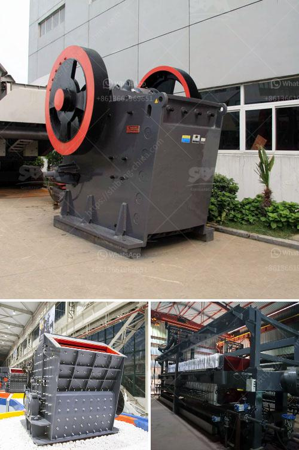

<h3>processing plan for feldspar ore</h3>
Feldspar is a widely used mineral that is primarily composed of aluminum, potassium, and sodium. It is commonly found in igneous, metamorphic, and sedimentary rocks and is an essential component for the production of ceramics, glass, and glass fibers. As a result, the processing of feldspar ore plays a crucial role in ensuring its availability and suitable quality for various industries.

The processing plan for feldspar ore typically involves several steps to remove impurities and enhance its properties. The first step is crushing the ore, which is commonly done using jaw crushers or gyratory crushers. This process reduces the ore into smaller pieces, increasing its surface area for subsequent processing.

After crushing, the ore is then subjected to grinding to reduce its size further. This is typically done using ball mills, which rotate the ore along with steel balls, enabling the desired size reduction. The grinding process helps to liberate the feldspar particles from the gangue minerals, making it easier to separate them.

To separate feldspar from undesired impurities, various techniques can be employed depending on the specific characteristics of the ore. One common method is froth flotation, where chemicals and air bubbles are used to selectively separate the feldspar from other minerals. The feldspar particles attach to the air bubbles and rise to the surface, forming a froth that can be skimmed off, leaving behind the impurities.

After flotation, the feldspar concentrate undergoes additional processes to further improve its quality. These processes may include magnetic separation to remove any remaining magnetic minerals, gravity separation to remove heavy minerals, and dewatering to remove excess water.

The final stage of processing involves drying and packaging the feldspar concentrate for transportation and storage. This ensures that the product remains free from moisture and suitable for use in various applications.

In conclusion, the processing plan for feldspar ore involves several crucial steps to remove impurities and enhance its properties. By employing techniques such as crushing, grinding, flotation, and additional treatments, the final product can meet the requirements of industries that rely on feldspar for their manufacturing processes. Overall, a well-designed processing plan ensures the availability of high-quality feldspar for various industrial applications.
<h3>Contact us</h3><ul><li><strong>Whatsapp:&nbsp;<a href="https://wa.me/8613661969651">+8613661969651</a></strong></li><li><a href="https://swt.shibang-china.com/?git&amp;zhl&amp;processing plan for feldspar ore"><strong>Online Service(chat now)</strong></a></li></ul><h3>Related</h3><ul><li><a href='gypsum processing machines.md'>gypsum processing machines</a></li><li><a href='stone crusher machine in kenya.md'>stone crusher machine in kenya</a></li><li><a href='company manufactures the best ball mill.md'>company manufactures the best ball mill</a></li><li><a href='aggregate crushers south africa.md'>aggregate crushers south africa</a></li><li><a href='kaolin manufacturing process.md'>kaolin manufacturing process</a></li></ul>