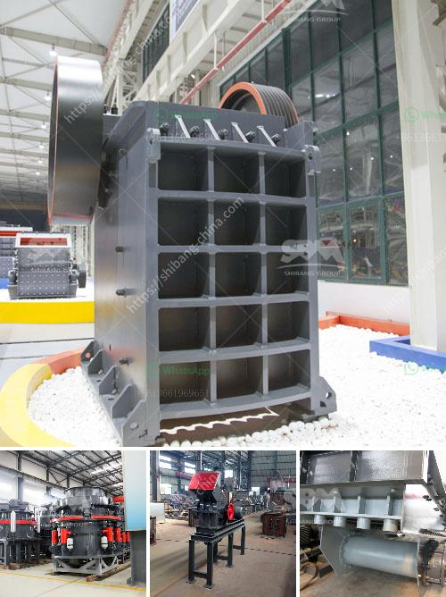

<h3>processing plant for sale south africa</h3>
South Africa, being one of the largest economies in Africa, has a thriving industrial sector that encompasses various industries, including agriculture, mining, and manufacturing. As these sectors continue to expand, the demand for processing plants has surged significantly. A processing plant plays a crucial role in processing raw materials into finished products, making it an essential investment for entrepreneurs and companies alike. In this article, we will explore the opportunities and advantages associated with purchasing a processing plant for sale in South Africa.

South Africa's industrial landscape is experiencing significant growth, propelled by its abundant natural resources and a skilled workforce. Various industries, such as food and beverages, mining, automotive, and pharmaceuticals, rely heavily on processing plants to refine and transform raw materials. With a processing plant, businesses can enhance their operational efficiency, reduce costs, and cater to the ever-growing demand for quality goods both domestically and on the international market.

1. Enhanced Operational Efficiency: Purchasing a processing plant allows businesses to streamline production processes, enabling them to meet increasing production demands effectively. Automated machinery and advanced technology incorporated in modern processing plants can significantly improve productivity, reduce waste, and ensure high-quality output consistently.

2. Cost Reduction: A dedicated processing plant reduces reliance on third-party manufacturers, ultimately cutting down costs associated with outsourcing processing requirements. Investing in your own processing plant provides businesses with better control over production costs, input materials, and quality control, resulting in improved profit margins.

3. Market Opportunities: In an increasingly globalized economy, purchasing a processing plant enhances a company's ability to capitalize on emerging market opportunities. With a processing plant in place, businesses gain a competitive advantage, allowing for increased production capacity and the ability to diversify their product offerings. This positions them to cater to both domestic and international markets, expanding their customer base and increasing their revenue potential.

4. Job Creation: By investing in a processing plant, not only do entrepreneurs benefit, but the acquisition also stimulates economic growth by creating employment opportunities for skilled and semi-skilled workers. As businesses expand their operations due to increased production, the need for a larger workforce arises, thereby contributing to reducing unemployment rates and empowering local communities.

The decision to purchase a processing plant in South Africa presents numerous advantages in terms of operational efficiency, cost-effectiveness, market opportunities, and job creation. However, potential buyers should consider several factors before finalizing any investment, such as the location, state of the plant's machinery, compliance with regulatory standards, and the presence of a skilled workforce. Engaging in thorough due diligence and seeking professional advice are crucial steps to ensure a sound investment in a processing plant that aligns with business goals and maximizes profitability. With South Africa's growing industrial sector, acquiring a processing plant can be a game-changer for entrepreneurs looking to capitalize on the country's abundant resources and emerging market opportunities.
<h3>Contact us</h3><ul><li><strong>Whatsapp:&nbsp;<a href="https://wa.me/8613661969651">+8613661969651</a></strong></li><li><a href="https://swt.shibang-china.com/?git&amp;zhl&amp;processing plant for sale south africa"><strong>Online Service(chat now)</strong></a></li></ul><h3>Related</h3><ul><li><a href='powder production line price.md'>powder production line price</a></li><li><a href='bauxite ore processing plant for sale.md'>bauxite ore processing plant for sale</a></li><li><a href='24 36 jaw crusher for sale usa.md'>24 36 jaw crusher for sale usa</a></li><li><a href='services of a crushing machine.md'>services of a crushing machine</a></li><li><a href='high pressure micro powder grinder in india.md'>high pressure micro powder grinder in india</a></li></ul>