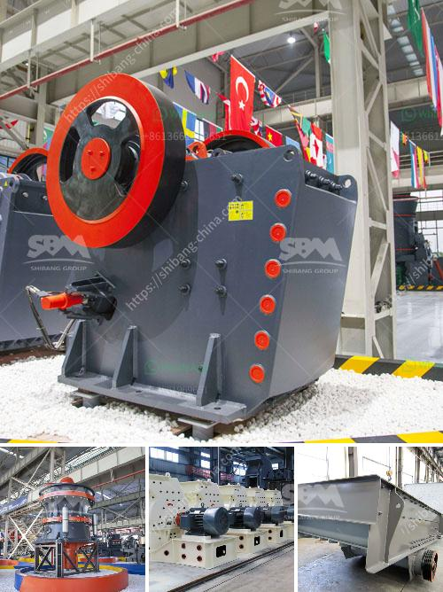

<h3>product of crushing plant</h3>
A crushing plant is a large one-stop installation with many moving components. Other than crushing for various purposes, it also serves other functions such as screening, sorting, and recycling. Crushing plants are used in mining and construction industries to convert rocks into aggregate or smaller pieces for further processing.

The main feature of the crushing plant is versatility. This plant is designed to produce various kinds of aggregate or sand. The material used for the production of aggregates varies, depending on the type of desired final product. They may include limestone, granite, basalt, sandstone, river rock, and others. Depending on the requirement of the end product, there may be a need for additional equipment such as a vibrating screen, a conveyor belt, or a generator.

Another important aspect of the crushing plant is its mobility. With the advancement in technology, crushing plants can now be transported to different locations with ease. This allows mining and construction companies to have access to the desired materials for production without having to rely solely on the availability of natural resources in a specific area.

Crushing plants are beneficial for various industries. For example, in the construction industry, the aggregate produced by the crushing plant is used for making concrete. The concrete is then used as a building material for constructing bridges, buildings, highways, and other structures. In the mining industry, the crushing plant is used to produce crushed metals and minerals, which are then used for various purposes, such as in the production of steel or in the manufacturing of electronic devices.

Overall, a crushing plant is a vital component of any mining or construction project. It provides the necessary materials needed for various production purposes and ensures the smooth running of the operation. With its versatility and mobility, it offers convenience and efficiency to industries, contributing to their growth and development.
<h3>Contact us</h3><ul><li><strong>Whatsapp:&nbsp;<a href="https://wa.me/8613661969651">+8613661969651</a></strong></li><li><a href="https://swt.shibang-china.com/?git&amp;zhl&amp;product of crushing plant"><strong>Online Service(chat now)</strong></a></li></ul><h3>Related</h3><ul><li><a href='gold mining crusher machinery.md'>gold mining crusher machinery</a></li><li><a href='types of stone crusher machine list.md'>types of stone crusher machine list</a></li><li><a href='ballast making machine kenya in kenya.md'>ballast making machine kenya in kenya</a></li><li><a href='three roll mills supplier.md'>three roll mills supplier</a></li><li><a href='jaw crusher for rent indonesia.md'>jaw crusher for rent indonesia</a></li></ul>