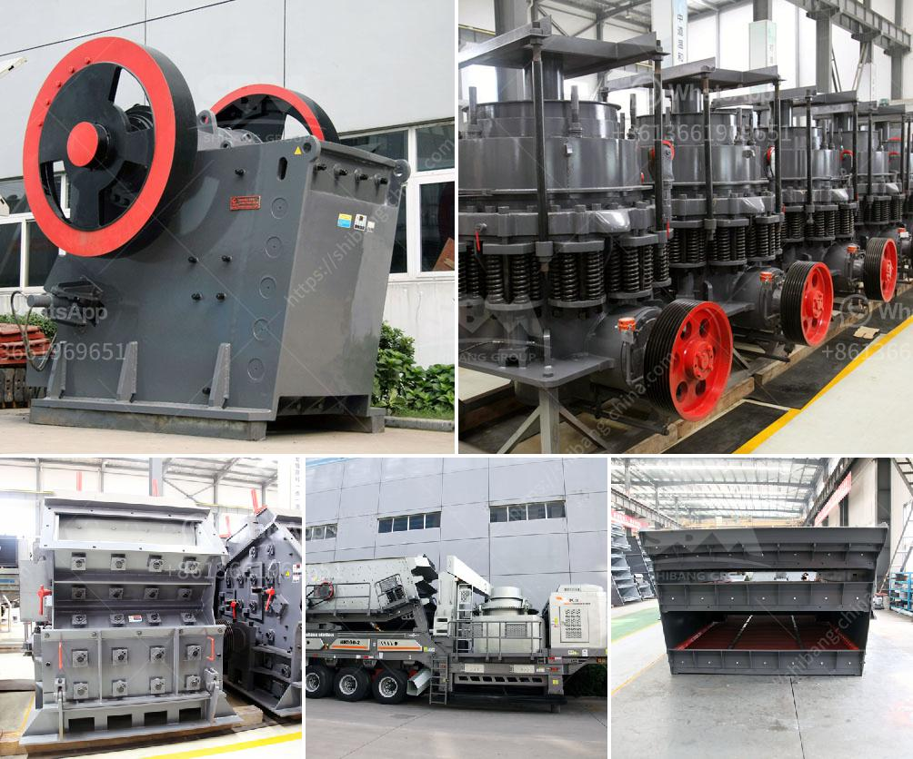

<h3>production of barium sulfate main plant equipment</h3>
Barium sulfate, also known as barite, is a crucial mineral used in various industries such as oil and gas, medical, automotive, and electronics. It is primarily used as a weighting agent in drilling fluids during oil and gas exploration and is important in medical imaging procedures. The production of barium sulfate involves various main plant equipment that ensures its high quality and purity. Let's delve into the main plant equipment used in the production of barium sulfate.

One essential piece of equipment in the production process is a crusher or pulverizer. This equipment is used to crush and grind barium sulfate raw materials into smaller particles before further processing. It is crucial to achieve a specific particle size distribution to ensure the desired quality and effectiveness of the final product.

After the initial grinding process, the crushed barium sulfate undergoes further refinement through a milling machine. This machine uses rotating blades or hammers to further reduce the particle size and achieve a finer powder. The milling process ensures that the particles are consistent in size, leading to improved dispersion and uniformity in the final product.

Next, the milled barium sulfate powder is subjected to a series of chemical processes. One common method is the precipitation process, where sulfide ions react with barium ions to form insoluble barium sulfate crystals. In this process, a reactor or crystallizer is used to facilitate the chemical reaction and promote the growth of the crystals. These reactors are typically made of stainless steel and equipped with agitators to ensure thorough mixing and a uniform reaction.

Once the barium sulfate crystals have formed, they are separated from the mother liquor using filtration equipment. Filtration involves passing the slurry through a porous medium, such as a filter cloth, to separate the solids from the liquid. Filtration equipment can vary depending on the scale of production, ranging from simple filter presses to more advanced rotary vacuum filters.

After filtration, the remaining barium sulfate cake is washed to remove impurities and excess soluble salts. This step is crucial in achieving a high purity level, ensuring that the final product meets industry standards. Washing equipment, such as rotary drum washers or water spray systems, is used to achieve efficient and thorough washing of the barium sulfate cake.

Finally, the washed barium sulfate cake is dried to remove any remaining moisture content. Drying equipment, such as rotary dryers or fluidized bed dryers, is used to achieve the desired moisture level while maintaining the integrity of the barium sulfate crystals.

In conclusion, the production of barium sulfate involves several key main plant equipment to ensure high quality and purity. Crushers and pulverizers are used to crush and grind the raw materials, while milling machines further refine the particles. Reactors and crystallizers facilitate the chemical precipitation process, while filtration equipment separates the barium sulfate crystals from the mother liquor. Washing and drying equipment ensure a high purity level and the desired moisture content in the final product. These main plant equipment play crucial roles in producing barium sulfate that meets the stringent requirements of various industries.
<h3>Contact us</h3><ul><li><strong>Whatsapp:&nbsp;<a href="https://wa.me/8613661969651">+8613661969651</a></strong></li><li><a href="https://swt.shibang-china.com/?git&amp;zhl&amp;production of barium sulfate main plant equipment"><strong>Online Service(chat now)</strong></a></li></ul><h3>Related</h3><ul><li><a href='mobile crusher for salt.md'>mobile crusher for salt</a></li><li><a href='used sand screen in south africa sale.md'>used sand screen in south africa sale</a></li><li><a href='how much can a quarry plant cost.md'>how much can a quarry plant cost</a></li><li><a href='jaw stone crusher in turkey.md'>jaw stone crusher in turkey</a></li><li><a href='stone crushers price in south.md'>stone crushers price in south</a></li></ul>