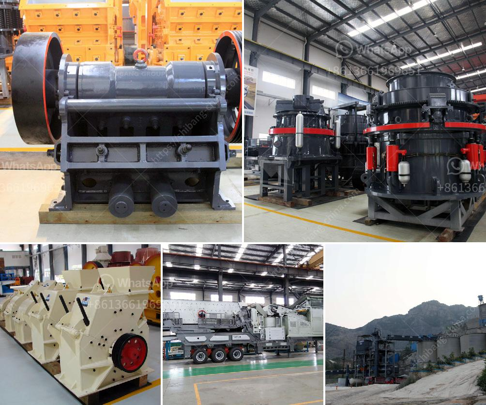

<h3>production process of cement</h3>
The production process of cement is a fascinating one. It consists of several steps that require a significant amount of time and energy. Here, we will discuss the various stages involved in the production of cement.

Firstly, the raw materials are extracted from quarries and mines. These materials include limestone, clay, shale, iron ore, and gypsum. It is important to ensure that these materials are of high quality to produce good quality cement. The extraction process involves blasting, drilling, and hauling the materials to a crusher, where they are reduced to a size suitable for further processing.

Once the raw materials are crushed, they are transported to a mixing chamber called the raw mill. Here, they are blended in the correct proportions to ensure a consistent quality of cement. The raw materials are ground into a fine powder, known as raw meal. The grinding process usually consists of rotating the raw mill for a specified period at a predetermined speed. The resulting raw meal is then transferred to a homogenization silo, where it is stored until further processing.

The next step in the production process is the preheating and calcination of the raw meal. This is done in a preheater tower, where the raw meal is heated to temperatures of around 900°C. The intense heat causes chemical reactions in the raw meal, known as calcination, which creates clinker. The clinker is a nodular material that resembles small rocks and is the main component of cement.

After the clinker is formed, it is cooled and then ground into a fine powder. This process is called cement milling. The clinker is combined with small amounts of gypsum and other additives such as fly ash or slag to give the final product its desired properties. These additives enhance the performance of the cement and can improve its strength, durability, and workability.

The final product is known as cement and is stored in silos before being dispatched to customers. Cement can be supplied in bulk, bags, or even in ready-mix concrete form for construction projects. Quality control measures are implemented throughout the process to ensure that the cement meets the required standards and specifications.

The production process of cement is energy-intensive and has a significant impact on the environment. It is important for cement manufacturers to adopt sustainable practices to reduce their carbon footprint. Many cement plants utilize alternative fuels, such as biomass, waste materials, or even tires, to replace fossil fuels like coal in the kiln. This not only reduces greenhouse gas emissions but also helps in the proper disposal of waste materials.

In conclusion, the production process of cement involves various stages, from the extraction of raw materials to the final distribution of the end product. Each step requires careful attention to detail and quality control measures to ensure that the cement meets the required standards. Furthermore, sustainable practices should be adopted to minimize the environmental impact of cement production.
<h3>Contact us</h3><ul><li><strong>Whatsapp:&nbsp;<a href="https://wa.me/8613661969651">+8613661969651</a></strong></li><li><a href="https://swt.shibang-china.com/?git&amp;zhl&amp;production process of cement"><strong>Online Service(chat now)</strong></a></li></ul><h3>Related</h3><ul><li><a href='eco stone crusher.md'>eco stone crusher</a></li><li><a href='benefit analysis for granite mining.md'>benefit analysis for granite mining</a></li><li><a href='greatwall jaw crusher.md'>greatwall jaw crusher</a></li><li><a href='gold mill tailings processing equipment.md'>gold mill tailings processing equipment</a></li><li><a href='industrial ball mill price and dimensions.md'>industrial ball mill price and dimensions</a></li></ul>