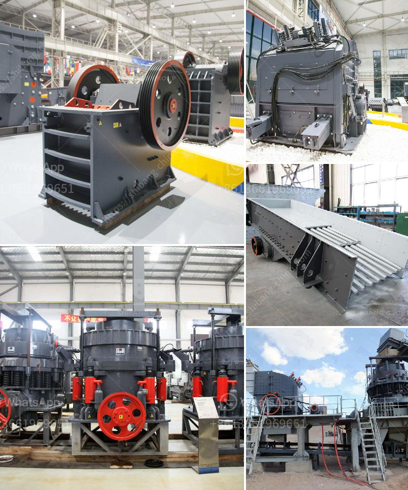

<h3>project cost of stone crusher of 100 tph</h3>
The cost of the project depends on the type of stone crusher, capacity, and the size and specifications of the stone crusher. The cost of a 100 tph stone crusher is determined by the following factors:

Type of stone crusher: different stone crushers have different prices. Some manufacturers tend to provide a higher price for their products, as they include high-quality components and durable parts.

Capacity: the capacity of the stone crusher determines how many stones can be crushed in one hour. A higher capacity stone crusher will require a higher investment to increase the production efficiency.

Size and specifications: the size and specifications of the stone crusher also affect the cost. A larger and more powerful stone crusher will generally require more investment than a smaller one.

Operational expenses: apart from the initial cost of purchasing the stone crusher, there are additional operational expenses to consider. These expenses include the cost of maintenance, repairs, fuel consumption, and labor costs.

The project cost of a stone crusher of 100 tph can range from around $700,000 to $1,000,000. This includes the cost of machines, installation, and an initial investment in crushing plant setup. Additionally, operational costs such as labor, maintenance, fuel consumption, and others should be considered.

To minimize the project cost, it is important to choose a reliable stone crusher manufacturer that provides high-quality products and after-sales support. It is also recommended to consult with professionals in the field to get accurate estimates for the project cost of a stone crusher of 100 tph.
<h3>Contact us</h3><ul><li><strong>Whatsapp:&nbsp;<a href="https://wa.me/8613661969651">+8613661969651</a></strong></li><li><a href="https://swt.shibang-china.com/?git&amp;zhl&amp;project cost of stone crusher of 100 tph"><strong>Online Service(chat now)</strong></a></li></ul><h3>Related</h3><ul><li><a href='market analysis of stone crusher.md'>market analysis of stone crusher</a></li><li><a href='design of stone crushing machine.md'>design of stone crushing machine</a></li><li><a href='primary impact crusher.md'>primary impact crusher</a></li><li><a href='300tph mobile crushing plant.md'>300tph mobile crushing plant</a></li><li><a href='puzzolana 100tph cone crusher plant price.md'>puzzolana 100tph cone crusher plant price</a></li></ul>