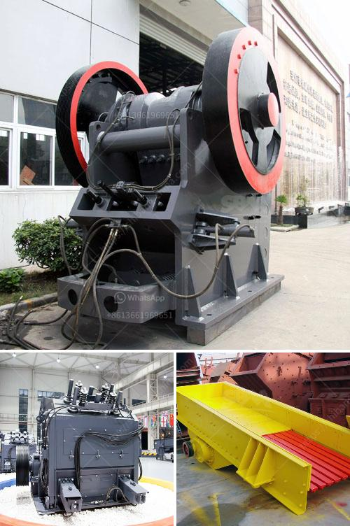

<h3>project report of lime processing unit</h3>
Lime processing is a profitable business opportunity that involves transforming limestone rocks into lime products. These lime products find applications across various industries such as construction, agriculture, steel manufacturing, and water treatment. This article provides an overview of a project report for establishing a lime processing unit, underscoring its scope, potential benefits, and key considerations.

The proposed lime processing unit aims to cater to the growing demand for lime products in the local and regional markets. The unit will be equipped with modern machinery for crushing limestone rocks, followed by a hydration process to produce quicklime. The project report envisions a production capacity of [X] metric tons per year, a target audience spanning builders, agriculture specialists, and industrialists.

Several factors need careful consideration while setting up a lime processing unit. These include acquiring the necessary permits and licenses, conducting a market analysis to identify potential customers and competitors, evaluating the availability of limestone reserves, and ensuring a sustainable supply chain for raw materials. The project report should also include a detailed financial analysis, outlining the initial investment, operational costs, projected revenue, and potential profitability.

The lime processing unit requires a suitable location with proximity to limestone reserves and basic infrastructure facilities like electricity, water, and transportation. Machinery required for the project includes crushers, screeners, kilns for the calcination process, and hydration systems. Adequate space should be designated for storage of raw materials, finished products, and packaging materials.

The lime processing unit holds tremendous market potential due to the ever-increasing demand for lime products. These products find extensive use in various sectors, offering a wide customer base. By analyzing market trends, understanding customer requirements, and implementing effective marketing strategies, the lime processing unit is expected to generate substantial revenue and become a financially viable venture.

Every project should prioritize environmental sustainability and social responsibility. The lime processing unit should adhere to environmental regulations, implementing appropriate measures for managing waste, controlling emissions, and conserving resources. Social considerations include ensuring employee safety, fair employment practices, and engagement with local communities to foster positive relationships.

Setting up a lime processing unit can be a profitable business venture, driven by the growing demand for lime products across multiple industries. By preparing a comprehensive project report, entrepreneurs can assess the feasibility, potential benefits, and associated risks. The report should cover all vital aspects, including market analysis, financial projections, infrastructure requirements, and environmental sustainability, paving the way for a successful lime processing unit.
<h3>Contact us</h3><ul><li><strong>Whatsapp:&nbsp;<a href="https://wa.me/8613661969651">+8613661969651</a></strong></li><li><a href="https://swt.shibang-china.com/?git&amp;zhl&amp;project report of lime processing unit"><strong>Online Service(chat now)</strong></a></li></ul><h3>Related</h3><ul><li><a href='cement clinker powder line.md'>cement clinker powder line</a></li><li><a href='grinding of calcined gypsum.md'>grinding of calcined gypsum</a></li><li><a href='coal grinding machinery manufacture in india.md'>coal grinding machinery manufacture in india</a></li><li><a href='bauxite processing into aluminum.md'>bauxite processing into aluminum</a></li><li><a href='quarry business plan sample.md'>quarry business plan sample</a></li></ul>