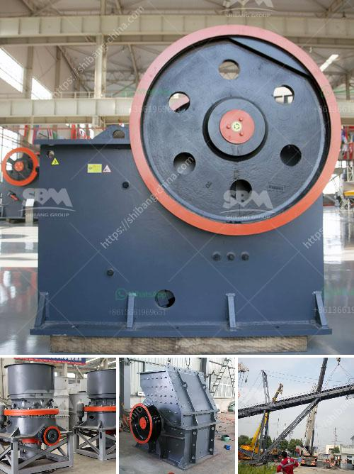

<h3>project report on quartz crusher industries</h3>
Quartz crushing industry is an important industrial sector in the country. It plays a crucial role in the economy of any nation. The main ingredients of quartz are silicon dioxide and oxygen, which are abundant in nature. Quartz is found in different forms, including quartz crystals, sandstone, and quartzite. It is used in various industries like glass, ceramics, and electronics.

The quartz crusher industry is a significant contributor to the growth of the economy. The crushers not only crush the quartz but also refine it and produce a variety of different size fractions. These fractions are used in various industries, such as construction, chemical, and manufacturing. The quartz crusher industry provides employment opportunities both directly and indirectly, thereby contributing to the overall development of the region.

A project report on quartz crusher industries analyzes the scope of the industry, current market trends, competition, and potential for growth. It provides a comprehensive overview of the industry, including market demand and supply, pricing analysis, investment feasibility, and regulatory environment.

The report also highlights the major players in the industry, their market share, and competitive strategies. It analyzes the strengths, weaknesses, opportunities, and threats (SWOT) of different companies, thereby providing an insight into their overall performance and market position.

The project report on quartz crusher industries also examines the latest technological advancements and innovations in the industry. It discusses the impact of these advancements on the production process, quality, and cost efficiency. The report identifies the key challenges faced by the industry and suggests strategies to overcome them.

Moreover, the project report on quartz crusher industries identifies potential growth areas and investment opportunities. It analyzes the demand-supply dynamics and market trends to help investors make informed decisions. The report also provides an analysis of the government policies, regulations, and incentives, along with their impact on the industry.

In conclusion, the project report on quartz crusher industries is a valuable resource for stakeholders, including investors, manufacturers, and policymakers. It provides a detailed analysis of the industry, market trends, competition, and growth potential. It helps in understanding the challenges and opportunities in the industry and formulating effective strategies for growth and development.

The quartz crusher industry is expected to witness significant growth in the coming years, driven by the increasing demand for quartz in various applications. The project report provides a comprehensive evaluation of the industry and helps stakeholders in making informed decisions.
<h3>Contact us</h3><ul><li><strong>Whatsapp:&nbsp;<a href="https://wa.me/8613661969651">+8613661969651</a></strong></li><li><a href="https://swt.shibang-china.com/?git&amp;zhl&amp;project report on quartz crusher industries"><strong>Online Service(chat now)</strong></a></li></ul><h3>Related</h3><ul><li><a href='ball mill working in hindi.md'>ball mill working in hindi</a></li><li><a href='mining process of calcium carbonate in south africa.md'>mining process of calcium carbonate in south africa</a></li><li><a href='cost to set up mini cement plant in india.md'>cost to set up mini cement plant in india</a></li><li><a href='gypsum board making machine supplier.md'>gypsum board making machine supplier</a></li><li><a href='lime morter grinding machine price list.md'>lime morter grinding machine price list</a></li></ul>