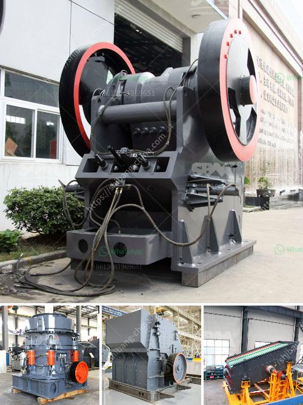

<h3>proposal for cement plant crusher</h3>
As the construction industry continues to expand globally, the demand for cement has become indispensable. Cement is a vital ingredient in the production of concrete, the most widely used construction material. To keep pace with the growing demand for cement, the establishment of new cement plants is required. A crucial aspect of these plants is their crushers, which play a significant role in the crushing of limestone and other materials to produce cement. This article discusses a proposal to introduce a new crusher in cement plants that could potentially enhance operational efficiency and sustainability.

The proposed crusher’s innovative design seeks to enhance operational efficiency in cement plants through various means:

1. Improved Energy Efficiency: The new crusher incorporates advanced technologies that reduce the energy required in the crushing process. By adopting a more efficient mechanism, such as design optimization or the use of energy-saving motors, the crusher will consume less power while achieving the same crushing capacity.

2. Increased Production Capacity: An essential feature of the proposed crusher is its ability to handle larger volumes of materials. By incorporating a wider opening, improved crushing chambers, and a more powerful motor, the crusher can accommodate larger quantities of limestone or other raw materials necessary for cement production. This increased capacity will allow cement plants to meet the rising demand efficiently.

3. Enhanced Automation: Automation plays a crucial role in optimizing the crusher's performance. The proposal includes the integration of modern control systems, allowing for real-time monitoring of various parameters such as feed rates, power consumption, and product quality. Such automation will help operators identify and address any performance issues promptly, improving overall plant efficiency.

Alongside operational efficiency, sustainability is a crucial concern for cement plants. The proposed crusher addresses sustainability through the following features:

1. Reduced Emissions: The new crusher will be designed to comply with the latest environmental standards and emission regulations. By adopting cutting-edge technologies, such as advanced dust suppression systems and improved exhaust filters, the crusher will ensure minimum dust and pollutant emissions, reducing its environmental footprint.

2. Conservation of Resources: Cement plants heavily rely on primary resources like limestone. The proposed crusher's design incorporates technologies that will enable efficient use of these resources, reducing waste and environmental impact. For example, the advanced crushing mechanism will enhance the extraction of material, minimizing waste generation and allowing for more effective utilization of limestone deposits.

3. Noise Reduction: Cement plants often face concerns from neighboring communities due to noise pollution. The proposed crusher will incorporate noise reduction technologies, such as soundproof enclosures and noise-absorbing materials, to minimize noise levels significantly. This will help cement plants maintain a sustainable relationship with nearby communities and meet noise regulations.

Introducing a new crusher in cement plants has the potential to enhance operational efficiency and promote sustainability. By incorporating advanced technologies, improving energy efficiency, increasing production capacity, and adhering to environmental standards, the proposed crusher will contribute to the growth of cement production while minimizing its impact on the environment. Ultimately, this proposal aims to create a win-win situation for cement plant operators, local communities, and the environment.
<h3>Contact us</h3><ul><li><strong>Whatsapp:&nbsp;<a href="https://wa.me/8613661969651">+8613661969651</a></strong></li><li><a href="https://swt.shibang-china.com/?git&amp;zhl&amp;proposal for cement plant crusher"><strong>Online Service(chat now)</strong></a></li></ul><h3>Related</h3><ul><li><a href='ball mill hammer mill.md'>ball mill hammer mill</a></li><li><a href='company manufactures the best ball mill.md'>company manufactures the best ball mill</a></li><li><a href='hammer crusher birotor.md'>hammer crusher birotor</a></li><li><a href='portable ballast crusher for sale.md'>portable ballast crusher for sale</a></li><li><a href='carbonate calcium of ball mill.md'>carbonate calcium of ball mill</a></li></ul>