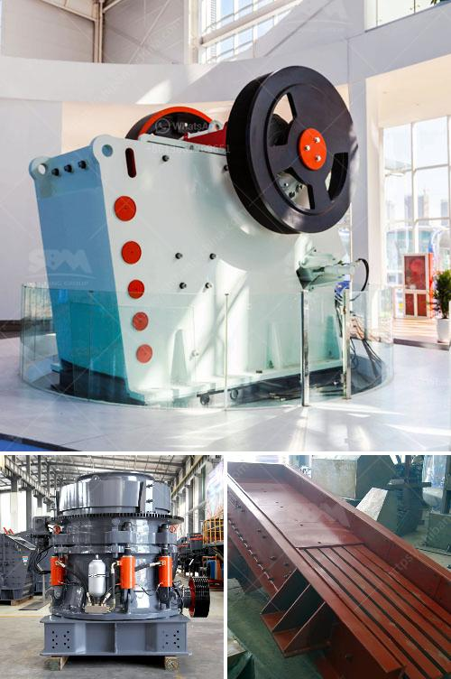

<h3>proposal for stone crushing business in kenya</h3>
Stone crushing industry is a lucrative business venture for new entrepreneurs. The demand for quality stones is increasing exponentially, which has led to the growth of this sector. The stone crushing business has been a major contributor to the economic growth and development in Kenya. In Kenya, stone crushing machines are used for crushing stones into small particles for building aggregates and sand production. Some stone crushing plants produce manufactured sand. This is a small-sized rock product with a maximum size of 0.50 centimeters (3/16th inch). Crushed stone from the tertiary sizing screen is sized in a vibrating inclined screen (fines screen) with relatively small mesh sizes.

Stone crushing projects are therefore essential for the success of infrastructure projects nationwide. Overall, the aim of this project is to generate knowledge on quality parameters of crushed granite aggregates and its possible utilization in the proposed construction project in Kenya.

To achieve this, a series of investigations will be carried out on selected crushed granites aggregates obtained from different locations. These investigations will involve laboratory tests on the strength, durability, and potential for performance of these crushed aggregates in construction. The test results will provide guidelines for designing durable stone crushing plants that are cost-effective for long-term sustainability.

Moreover, the project will identify the machinery required for stone crushing and prepare a cost estimate of the plant establishment. It will also provide a detailed financial analysis of the investment, including the payback period, return on investment, and net present value.

Additionally, a comprehensive and strategic marketing plan will be developed to identify potential customers and markets for the crushed stone aggregates. This will involve conducting market surveys, identifying potential clients, and establishing partnerships with construction companies, road contractors, and other stakeholders.

The proposal also includes conducting an environmental impact assessment (EIA) to ensure that the stone crushing plant complies with environmental guidelines and regulations. This will minimize the negative impact of the project on the surrounding environment, including noise pollution, dust emissions, and other potential hazards.

To sum up, the proposal for a stone crushing business in Kenya is aimed at generating knowledge on the quality parameters of crushed granite aggregates and its utilization potential in construction projects. Alongside this, it will also provide a cost estimate of establishment, financial analysis, marketing plan, and environmental impact assessment to ensure the sustainability and success of the venture. With the growing demand for quality stones in Kenya, this business venture is expected to be promising and profitable for new entrepreneurs.
<h3>Contact us</h3><ul><li><strong>Whatsapp:&nbsp;<a href="https://wa.me/8613661969651">+8613661969651</a></strong></li><li><a href="https://swt.shibang-china.com/?git&amp;zhl&amp;proposal for stone crushing business in kenya"><strong>Online Service(chat now)</strong></a></li></ul><h3>Related</h3><ul><li><a href='cement plant operations handbook.md'>cement plant operations handbook</a></li><li><a href='quarry crusher equipments for sale in ibadan nigeria.md'>quarry crusher equipments for sale in ibadan nigeria</a></li><li><a href='calcium silicone crushers.md'>calcium silicone crushers</a></li><li><a href='for sale used mobile jaw crusher australia.md'>for sale used mobile jaw crusher australia</a></li><li><a href='manufacture of conveyor belts in bogota.md'>manufacture of conveyor belts in bogota</a></li></ul>