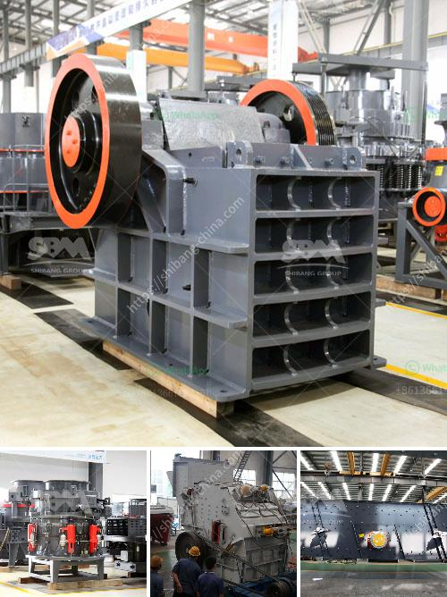

<h3>proposal pabrik stone crusher</h3>
The development of infrastructure and urbanization projects has resulted in substantial growth in the construction industry. This has created a high demand for raw materials such as stones, sand, and gravel, which are essential for the production of concrete and asphalt. To meet this rising demand, a proposal is made to establish a stone crushing factory with a capacity of 30,000 tons per annum.

The objective of this proposal is to enhance the sustainable development of the construction industry by providing stone crushing infrastructure, thereby generating employment, improving infrastructure, and contributing to the nation's economy.

The proposed factory will be located in a strategic area near major construction sites and existing stone quarries. This will minimize transportation costs and reduce the environmental impact caused by long-distance transportation.

The stone crushing factory will have operational capacity of 1000 square feet per day and will be equipped with a jaw crusher, impact crusher, and vibrating screen. All necessary equipment and machinery will be imported from reputable manufacturers or suppliers.

The plant will be capable of producing crushed stones of various sizes, including 20mm, 10mm, and concrete sand. The factory’s production capacity will be 30,000 tons per annum, with the potential for further expansion in the future based on market demand.

A comprehensive market analysis reveals considerable demand for crushed stones among various stakeholders such as individual clients, construction companies, road and highway contractors, and government projects. Extensive marketing efforts will be undertaken to establish strong relationships with these potential customers.

The stone crushing factory will adhere to all environmental regulations and guidelines, ensuring eco-friendly practices. A comprehensive environmental impact assessment will be carried out before commencement of operations to identify any potential negative impacts and formulate mitigation measures.

The establishment of this stone crushing factory will create numerous employment opportunities. With a factory of this scale, it is expected to directly employ at least 25 skilled and unskilled laborers. Additionally, indirect employment opportunities will be created through the provision of services such as transportation, maintenance, and other related sectors.

The total investment required for the establishment of the stone crushing factory is estimated at $500,000. A break-even analysis indicates that the factory will reach its break-even point within three years of operation. The primary sources of revenue will be derived from the sale of crushed stones to various construction projects.

The proposed establishment of a stone crushing factory will significantly contribute to the development of the construction industry by providing a steady and reliable supply of raw materials. Additionally, this project will stimulate economic growth, provide employment opportunities, and promote sustainable development. It is recommended that the relevant authorities and investors carefully evaluate and support this proposal in order to ensure its successful implementation.
<h3>Contact us</h3><ul><li><strong>Whatsapp:&nbsp;<a href="https://wa.me/8613661969651">+8613661969651</a></strong></li><li><a href="https://swt.shibang-china.com/?git&amp;zhl&amp;proposal pabrik stone crusher"><strong>Online Service(chat now)</strong></a></li></ul><h3>Related</h3><ul><li><a href='copper ore processing plant kenya.md'>copper ore processing plant kenya</a></li><li><a href='closing of crushing plant.md'>closing of crushing plant</a></li><li><a href='stone crusher second hand south africa.md'>stone crusher second hand south africa</a></li><li><a href='puzzolana tph cone crusher plant prices.md'>puzzolana tph cone crusher plant prices</a></li><li><a href='kaolin processing equipment fabricators in nigeria.md'>kaolin processing equipment fabricators in nigeria</a></li></ul>