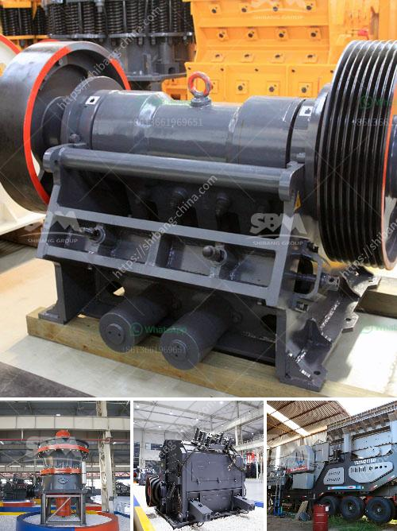

<h3>pulveriser machine new technolgy</h3>
In recent years, industries across the globe have witnessed significant advancements in various technologies. Among them, the pulverizer machine stands out as a true game-changer. With its cutting-edge features and improved functionality, this new technology has revolutionized countless industries, including manufacturing, mining, agriculture, and more. Let's delve deeper into the innovative aspects and benefits of this state-of-the-art pulverizer machine.

Traditional pulverizer machines were primarily used for grinding and crushing a range of materials. However, the new pulverizer machine technology has taken efficiency to a whole new level. The latest models are designed with advanced mechanisms that ensure precise and faster grinding, reducing processing time significantly. This enhanced efficiency translates into higher productivity for industries, allowing them to meet market demands swiftly.

One of the standout features of the new pulverizer machine technology is the ability to customize various settings according to specific requirements. Manufacturers can easily adjust the speed, grinding capacity, and the coarseness or fineness of the ground material. This customization feature allows industries to cater to diverse applications effectively, giving them a competitive edge.

Automation has become an integral part of modern industries, and pulverizer machines are no exception. With the incorporation of advanced technologies like artificial intelligence and sensor-based systems, these machines offer enhanced automation capabilities. The new pulverizer machines come equipped with intuitive control panels and safety features that minimize human intervention, thus reducing the risk of accidents and injuries in the workplace.

In the era of sustainability, energy efficiency has become a key concern for industries worldwide. The latest pulverizer machine technology addresses this by incorporating energy-saving features. Advanced motor technologies and optimized grinding mechanisms ensure lower energy consumption without compromising productivity. Consequently, industries can reduce their carbon footprint and save on energy costs simultaneously.

With its remarkable advancements, the new pulverizer machine technology is transforming industries and increasing overall operational efficiencies. From increased productivity and customized settings to improved safety and energy efficiency, this technology has surpassed its predecessors in every aspect. As the demand for quality products and sustainable practices continues to grow, the pulverizer machine's new technology is undoubtedly set to play a crucial role in a wide range of industries, leading to a more efficient and sustainable future.
<h3>Contact us</h3><ul><li><strong>Whatsapp:&nbsp;<a href="https://wa.me/8613661969651">+8613661969651</a></strong></li><li><a href="https://swt.shibang-china.com/?git&amp;zhl&amp;pulveriser machine new technolgy"><strong>Online Service(chat now)</strong></a></li></ul><h3>Related</h3><ul><li><a href='cement plant for sale in india 200 tpd.md'>cement plant for sale in india 200 tpd</a></li><li><a href='grinder mill china.md'>grinder mill china</a></li><li><a href='stone mill grinder price.md'>stone mill grinder price</a></li><li><a href='how to start stone crusher project.md'>how to start stone crusher project</a></li><li><a href='concrete crusher for sale in nigeria.md'>concrete crusher for sale in nigeria</a></li></ul>