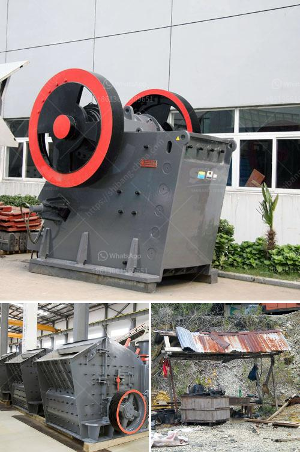

<h3>pulveriser with single pot</h3>
The pulverizer with a single pot is a versatile and efficient machine used in various industries for grinding and pulverizing materials. It is a compact and easy-to-use equipment that provides excellent results in a short amount of time. With its numerous benefits, the single pot pulverizer has become a popular choice among manufacturers and researchers.

The main advantage of the single pot pulverizer is its simplicity. It consists of just one pot or container where the grinding or pulverizing process occurs. This design minimizes the number of parts and components, making it easy to assemble and maintain. Additionally, the single pot design allows for quick and hassle-free cleaning, preventing any cross-contamination when switching between different materials.

Another key benefit of the single pot pulverizer is its high efficiency. Its powerful motor ensures that materials are ground or pulverized to the desired fineness in a short time frame. This saves both time and energy, increasing productivity and reducing production costs. Moreover, the single pot design enables homogeneous mixing, resulting in consistent and uniform pulverization.

The single pot pulverizer is also highly customizable, with various options available to suit different requirements. It can be designed to handle a wide range of materials, from soft and fibrous to hard and brittle substances. This flexibility makes it suitable for a diverse range of industries, including pharmaceuticals, chemicals, food processing, and mining.

When it comes to safety, the single pot pulverizer excels as well. It is equipped with safety features such as automatic shut-off, overload protection, and a locking mechanism to prevent accidents and injuries. Furthermore, the compact design of the machine ensures a small footprint, making it suitable for both small-scale and large-scale operations.

One of the key considerations when choosing a pulverizer is its maintenance and longevity. The single pot design simplifies maintenance, reducing downtime and costs. With proper care and regular servicing, the single pot pulverizer can provide years of reliable performance.

In conclusion, the pulverizer with a single pot is a versatile and efficient machine that offers numerous benefits in various industries. Its simplicity, high efficiency, safety features, and customizability make it a popular choice among manufacturers and researchers alike. Whether it's grinding or pulverizing materials, this compact and easy-to-use equipment delivers excellent results in a short amount of time. With its durability and low maintenance requirements, the single pot pulverizer is a valuable investment for any industry seeking to enhance productivity and achieve consistent and uniform results.
<h3>Contact us</h3><ul><li><strong>Whatsapp:&nbsp;<a href="https://wa.me/8613661969651">+8613661969651</a></strong></li><li><a href="https://swt.shibang-china.com/?git&amp;zhl&amp;pulveriser with single pot"><strong>Online Service(chat now)</strong></a></li></ul><h3>Related</h3><ul><li><a href='iron ore melting plant supplier china.md'>iron ore melting plant supplier china</a></li><li><a href='washing plant suppliers in mozambique.md'>washing plant suppliers in mozambique</a></li><li><a href='coal crushing and screening plant for sale south africa.md'>coal crushing and screening plant for sale south africa</a></li><li><a href='sand screening machines in south africa.md'>sand screening machines in south africa</a></li><li><a href='gold crusher philippines.md'>gold crusher philippines</a></li></ul>