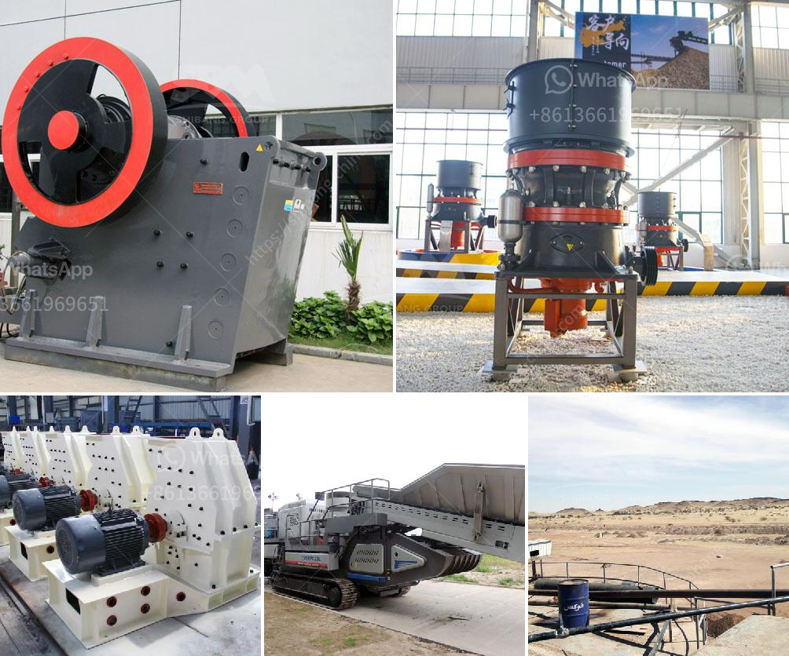

<h3>pulverizer coal with gasifier</h3>
In the quest for a greener and more sustainable future, the energy sector is constantly exploring cleaner and more efficient alternatives. One such solution that has gained significant attention is the use of a pulverizer coal with gasifier technology. This innovative approach combines the use of pulverized coal, a conventional energy source, with a gasifier, a more environmentally friendly and efficient method of harnessing energy.

To understand the significance of this technology, let's first delve into the basics of what a pulverizer coal with gasifier system entails. A pulverizer, which is essentially a coal grinder, is used to grind coal into small particles. These fine particles are then mixed with air and blown into the gasifier, a pressurized vessel where the coal undergoes a chemical reaction known as gasification.

During gasification, the coal particles react with steam and oxygen, producing a mixture of carbon monoxide (CO) and hydrogen (H2), commonly known as synthesis gas or syngas. This syngas is then purified and utilized as a fuel source in a variety of applications.

One of the primary advantages of utilizing pulverized coal with gasifier technology is its environmental impact. Traditional coal-fired power plants release significant amounts of harmful emissions, including sulfur dioxide, nitrogen oxides, and carbon dioxide. In contrast, gasification drastically reduces these emissions, making it a cleaner alternative.

In addition to reducing emissions, pulverized coal with gasifier systems also support higher energy efficiency. With the gasification process, the conversion of coal into syngas is highly efficient, resulting in minimal energy loss. This increased efficiency translates to greater energy output for the same amount of coal input, making it a cost-effective solution in the long run.

Furthermore, the flexibility of pulverized coal with gasifier technology allows for easy integration with existing infrastructure. Most conventional coal power plants can be retrofitted with a gasifier, minimizing the need for additional investment in new facilities. This adaptability makes it a viable option for transitioning from conventional coal-fired power generation to more sustainable alternatives.

Apart from electricity generation, pulverized coal with gasifier technology has promising applications in other sectors as well. The syngas produced can be used to produce synthetic natural gas (SNG), which can be used in heating and transportation. It can also serve as a feedstock for the chemical industry, supporting the production of various useful chemicals and materials.

Despite the numerous benefits, there are challenges and considerations that need to be addressed when implementing pulverized coal with gasifier technology. The initial capital cost of installing a gasifier can be significant, requiring careful financial planning. Additionally, the gasification process demands a consistent and high-quality coal supply to ensure optimal performance.

In conclusion, pulverized coal with gasifier technology offers a compelling solution for a cleaner and more sustainable energy future. By combining the efficiency of pulverized coal with the environmental benefits of gasification, this technology reduces emissions, increases energy output, and provides flexibility in transitioning from conventional coal-fired power plants. With further research, development, and investment, this technology has the potential to play a crucial role in the global energy transition towards a low-carbon future.
<h3>Contact us</h3><ul><li><strong>Whatsapp:&nbsp;<a href="https://wa.me/8613661969651">+8613661969651</a></strong></li><li><a href="https://swt.shibang-china.com/?git&amp;zhl&amp;pulverizer coal with gasifier"><strong>Online Service(chat now)</strong></a></li></ul><h3>Related</h3><ul><li><a href='jaw crusher in german.md'>jaw crusher in german</a></li><li><a href='services of a crushing machine.md'>services of a crushing machine</a></li><li><a href='combined gold and diamond wash plants.md'>combined gold and diamond wash plants</a></li><li><a href='hydration process of cement.md'>hydration process of cement</a></li><li><a href='kenya vibrating screen is manufactured.md'>kenya vibrating screen is manufactured</a></li></ul>